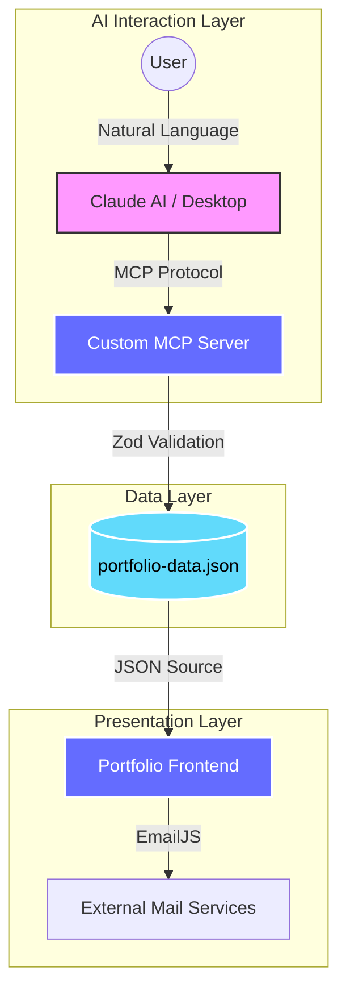

# Portfolio OS — Thien Phuc

<div align="center">

[](https://reactjs.org/)
[](https://www.typescriptlang.org/)
[](https://vitejs.dev/)
[](https://modelcontextprotocol.io/)
[](LICENSE)

**A high-performance, AI-driven portfolio management system featuring a premium UI and integrated Model Context Protocol (MCP) server.**

[Live Demo](#) • [MCP Documentation](./docs/mcp/) • [Report Bug](../../issues) • [Request Feature](../../issues)

</div>

---

## 📖 Introduction

**Portfolio OS** is more than just a personal website; it's a dynamic content ecosystem. Built with a "Design-First" mentality, it combines a sleek, minimalist frontend architecture with a powerful AI management layer.

At its core, this project leverages the **Model Context Protocol (MCP)**, allowing you to manage your professional identity—projects, skills, and career milestones—directly through AI assistants like Claude. No more manual JSON editing; just talk to your portfolio.

### 🏛️ Philosophy
- **Immersive UX**: Utilizing smooth scrolling and motion orchestration to create a "living" interface.
- **AI-Native**: Content isn't static; it's managed via context-aware AI tools.
- **Developer Centric**: Clean, type-safe codebase designed for extensibility and performance.

---

## ✨ Key Features

### 🎨 Frontend Experience (The "View")
- **Premium Aesthetics**: Stealth dark mode with bold typography and glassmorphism.
- **Motion System**: Butter-smooth scrolling (Lenis) and parallax orchestration (GSAP + Framer Motion).
- **Interactive Cursor**: Custom event-aware cursor for enhanced engagement.
- **Responsive Layout**: Pixel-perfect scaling from 4K monitors to mobile devices.
- **Unified Contact**: Integrated EmailJS with auto-reply and owner notification systems.

### 🤖 AI Management (The "Controller")
- **MCP Integration**: Native support for Model Context Protocol.
- **Natural Language Updates**: "Add a new project about Fintech" — handled instantly by the AI.
- **Dual-Mode Server**: Runs locally via `stdio` (Desktop) or as a remote HTTP API (Mobile/Web).
- **Type-Safe Schema**: Data integrity enforced by Zod validation across the entire stack.
- **JSON Export**: One-click data portability for backups or cross-platform migrations.

---

## 🏗️ Overall Architecture

The project follows a decoupled architecture where the Frontend consumes data managed by an autonomous MCP Server.



### Technical Stack
- **Frontend**: React 18, TypeScript, Vite, GSAP, Framer Motion, Lenis, CSS Modules.
- **Backend (MCP)**: Node.js, Express, @modelcontextprotocol/sdk, Zod.
- **Operations**: Vercel (Hosting), EmailJS (Communications).

---

## 🚀 Installation

### 1. Prerequisites
- **Node.js**: v18.x or higher
- **npm**: v9.x or higher
- **Claude Desktop**: (Optional, for local AI management)

### 2. Clone & Setup
```bash
# Clone the repository
git clone https://github.com/phuc2502/portfolio_thienphuc.git
cd portfolio_thienphuc

# Install Frontend dependencies
npm install

# Install MCP Server dependencies
cd mcp-server && npm install && cd ..
```

---

## 🏃 Running the Project

### Development Mode (Frontend)
```bash
npm run dev
```
Access the UI at `http://localhost:3000`.

### AI Management Mode (MCP Server)
To manage your content via Claude, you must build and link the server:

```bash
# Build the server
cd mcp-server
npm run build

# Start local server (stdio)
npm start
```

---

## ⚙️ Env Configuration

Create a `.env` file in the root directory for frontend features:

```env
# --- EmailJS Config ---
VITE_EMAILJS_SERVICE_ID=service_xxxxxxx
VITE_EMAILJS_TEMPLATE_ID=template_xxxxxxx
VITE_EMAILJS_OWNER_TEMPLATE_ID=template_xxxxxxx
VITE_EMAILJS_PUBLIC_KEY=xxxxxxxxxxxxxxxxx

# --- Optional AI Features ---
GEMINI_API_KEY=your_gemini_api_key
```

For the **MCP Server**, configuration is handled via `claude_desktop_config.json`:
```json
{
  "mcpServers": {
    "portfolio": {
      "command": "node",
      "args": ["D:\\portfolio_thienphuc\\mcp-server\\dist\\index.js"]
    }
  }
}
```

---

## 📁 Folder Structure

```text
portfolio_thienphuc/
├── src/                 # Source code chính
│   ├── components/      # Reusable UI primitives (Hero, About, Projects)
│   ├── contexts/        # Global state logic
│   ├── types/           # Global TypeScript interfaces
│   ├── App.tsx          # Main layout & Routing
│   ├── index.tsx        # Application entry point
│   └── vite-env.d.ts    # Vite environment types
├── docs/                # Tài liệu dự án
│   ├── mcp/             # MCP Server documentation
│   │   ├── archive/     # Lưu trữ phiên bản cũ
│   │   ├── COMPLETE_GUIDE.md
│   │   └── QUICK_FIX.md
│   └── contributing/    # Contribution guidelines
│       └── CONTRIBUTING.md
├── mcp-server/          # Full-stack MCP implementation
│   ├── src/             # TypeScript source code
│   │   ├── index.ts     # MCP entry point (stdio)
│   │   ├── api.ts       # HTTP API entry point
│   │   └── data/        # JSON storage (Source of truth)
│   ├── metadata.json    # Server metadata
│   ├── claude_desktop_config.json  # Claude Desktop config
│   └── package.json     # Server dependencies
├── scripts/             # Utility scripts
│   ├── sync-portfolio-data.js
│   └── download-artifacts.ps1
├── public/              # Static assets (3D models, large images)
├── index.html           # HTML entry point
├── vite.config.ts       # Build orchestration
├── tsconfig.json        # TypeScript configuration
└── package.json         # Frontend dependencies
```

---

## 🤝 Contribution Guidelines

We love contributors! If you want to improve Portfolio OS, please follow these steps:

1. **Fork** the repository.
2. **Create** a feature branch (`git checkout -b feature/AmazingFeature`).
3. **Commit** your changes using [Conventional Commits](https://www.conventionalcommits.org/).
4. **Push** to the branch (`git push origin feature/AmazingFeature`).
5. **Open** a Pull Request.

**Note:** Ensure all code passes `npm run build` and has no TypeScript errors before submitting.

---

## 🗺️ Roadmap

- [x] **Phase 1**: High-end UI with GSAP animations.
- [x] **Phase 2**: MCP Server for AI-driven data management.
- [ ] **Phase 3**: Multi-language support (i18n) via MCP tools.
- [ ] **Phase 4**: 3D Scene integration with Three.js (Fiber).
- [ ] **Phase 5**: Real-time analytics dashboard for profile views.

---

## 📄 License

Distributed under the **MIT License**. See `LICENSE` for more information.

---

<div align="center">

**Built with Precision by [Thien Phuc](https://github.com/phuc2502)**

*Elevating professional identity through AI.*

[↑ Back to Top](#portfolio-os--thien-phuc)

</div>
