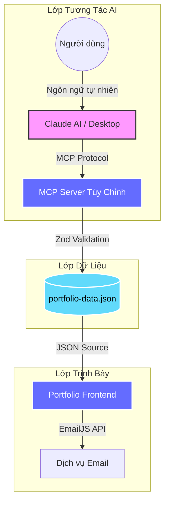

# 🎨 Portfolio OS — Thiện Phúc

<div align="center">

[](https://reactjs.org/)
[](https://www.typescriptlang.org/)
[](https://vitejs.dev/)
[](https://modelcontextprotocol.io/)
[](https://thienphuc2025.vercel.app/)
[](LICENSE)

**Website portfolio cá nhân hiệu suất cao, tích hợp AI qua Model Context Protocol (MCP).**

[🌐 Xem Demo](https://thienphuc2025.vercel.app/) • [📖 Tài liệu MCP](./docs/mcp/) • [🐛 Báo lỗi](../../issues) • [💡 Góp ý tính năng](../../issues)

</div>

---

## 📖 Giới thiệu

**Portfolio OS** không chỉ là một website cá nhân thông thường — đây là một **hệ sinh thái nội dung động** được xây dựng theo triết lý **"Design-First"** (thiết kế là ưu tiên hàng đầu).

Dự án kết hợp giữa giao diện frontend tối giản, sang trọng với một **lớp quản lý nội dung bằng AI** thông qua Model Context Protocol (MCP). Bạn có thể quản lý dự án, kỹ năng và các mốc sự nghiệp trực tiếp thông qua trợ lý AI Claude — không cần chỉnh sửa file JSON thủ công.

### 🏛️ Triết lý thiết kế

| Nguyên tắc | Mô tả |
|:---:|---|
| 🎭 **Trải nghiệm nhập vai** | Cuộn mượt mà, hiệu ứng chuyển động tinh tế tạo cảm giác giao diện "sống động" |
| 🤖 **AI-Native** | Nội dung không tĩnh, mà được quản lý bởi AI qua giao thức chuẩn hóa |
| ⚡ **Developer-Centric** | Codebase sạch, type-safe, dễ mở rộng và tối ưu hiệu suất |

---

## ✨ Tính năng nổi bật

### 🎨 Giao diện Frontend

- **Thiết kế premium** — Phong cách dark mode tinh tế với kiểu chữ đậm (bold typography) và hiệu ứng glassmorphism
- **Hệ thống chuyển động** — Cuộn mượt mà (Lenis), parallax và animation phối hợp (GSAP + Framer Motion)
- **Con trỏ tùy chỉnh** — Custom cursor phản ứng theo ngữ cảnh, tăng cường tương tác
- **Responsive hoàn hảo** — Hiển thị đẹp từ màn hình 4K đến thiết bị di động
- **Video Player tích hợp** — Phát video giới thiệu trong section Hero
- **Form liên hệ EmailJS** — Hệ thống gửi email tự động gồm auto-reply cho người gửi và thông báo cho chủ sở hữu

### 🤖 Quản lý bằng AI (MCP Server)

- **Tích hợp MCP** — Hỗ trợ giao thức Model Context Protocol chuẩn
- **Cập nhật bằng ngôn ngữ tự nhiên** — Ví dụ: *"Thêm dự án mới về Fintech"* → AI xử lý ngay lập tức
- **Dual-Mode** — Chạy cục bộ qua `stdio` (Claude Desktop) hoặc API HTTP từ xa
- **Xác thực dữ liệu** — Tính toàn vẹn dữ liệu được đảm bảo bởi Zod validation
- **Xuất JSON** — Sao lưu và di chuyển dữ liệu dễ dàng giữa các nền tảng

---

## 🛠️ Công nghệ sử dụng

### Frontend
| Công nghệ | Phiên bản | Mục đích |
|---|---|---|
| [React](https://reactjs.org/) | 18.2.0 | Thư viện UI chính |
| [TypeScript](https://www.typescriptlang.org/) | 5.8.2 | Kiểm tra kiểu tĩnh |
| [Vite](https://vitejs.dev/) | 6.2.0 | Build tool & Dev server |
| [GSAP](https://greensock.com/gsap/) | 3.14.2 | Animation nâng cao, ScrollTrigger |
| [Framer Motion](https://www.framer.com/motion/) | 11.11.11 | Animation khai báo cho React |
| [Lenis](https://github.com/darkroomengineering/lenis) | 1.0.42 | Smooth scrolling |
| [EmailJS](https://www.emailjs.com/) | 4.4.1 | Gửi email trực tiếp từ frontend |
| [Lucide React](https://lucide.dev/) | 0.562.0 | Bộ icon SVG |
| [TailwindCSS](https://tailwindcss.com/) | CDN | Utility-first CSS framework |

### MCP Server (Backend)
| Công nghệ | Mục đích |
|---|---|
| [Node.js](https://nodejs.org/) | Runtime |
| [Express](https://expressjs.com/) | HTTP API |
| [@modelcontextprotocol/sdk](https://modelcontextprotocol.io/) | Giao thức MCP |
| [Zod](https://zod.dev/) | Xác thực schema |

### Hạ tầng
| Dịch vụ | Mục đích |
|---|---|
| [Vercel](https://vercel.com/) | Hosting & CI/CD |
| [EmailJS](https://www.emailjs.com/) | Dịch vụ gửi email |
| [Google Fonts](https://fonts.google.com/) | Typography (Montserrat, JetBrains Mono) |

---

## 🏗️ Kiến trúc tổng quan

Dự án tuân theo kiến trúc **tách biệt (decoupled)**: Frontend tiêu thụ dữ liệu được quản lý bởi MCP Server độc lập.



### Luồng hoạt động

```
┌─────────────┐     ┌──────────────┐     ┌────────────────────┐
│  Người dùng  │────▶│  Claude AI   │────▶│   MCP Server       │
│  (Chat AI)   │     │  (Xử lý NLP) │     │ (CRUD dữ liệu)    │
└─────────────┘     └──────────────┘     └────────┬───────────┘
                                                   │
                                                   ▼
┌─────────────┐     ┌──────────────┐     ┌────────────────────┐
│  Trình duyệt │◀───│  Vite Build  │◀───│ portfolio-data.json │
│  (UI hiển thị)│    │  (Đóng gói)   │     │ (Nguồn dữ liệu)   │
└─────────────┘     └──────────────┘     └────────────────────┘
```

---

## 📁 Cấu trúc thư mục

```text
portfolio_thienphuc/
│
├── 📄 index.html              # Điểm vào HTML chính
├── 📄 vite.config.ts          # Cấu hình Vite (alias, port, plugin)
├── 📄 tsconfig.json           # Cấu hình TypeScript
├── 📄 package.json            # Dependencies frontend
├── 📄 .env.local              # Biến môi trường (KHÔNG đẩy lên Git)
├── 📄 .gitignore              # Danh sách file/thư mục bỏ qua
├── 📄 LICENSE                 # Giấy phép MIT
│
├── 📂 src/                    # ========== SOURCE CODE CHÍNH ==========
│   ├── 📄 index.tsx           # Entry point — render React App
│   ├── 📄 App.tsx             # Layout chính: Header, Sections, Footer
│   ├── 📄 vite-env.d.ts       # Khai báo kiểu cho biến môi trường Vite
│   │
│   ├── 📂 components/         # ---- Các thành phần UI ----
│   │   ├── 📄 Header.tsx      # Thanh điều hướng trên cùng
│   │   ├── 📄 Menu.tsx        # Menu toàn màn hình (fullscreen overlay)
│   │   ├── 📄 Hero.tsx        # Section đầu tiên — ấn tượng mạnh
│   │   ├── 📄 HeroVideoPlayer.tsx  # Video player nhúng trong Hero
│   │   ├── 📄 VideoPlayer.tsx # Component video player tái sử dụng
│   │   ├── 📄 About.tsx       # Giới thiệu bản thân
│   │   ├── 📄 Story.tsx       # Câu chuyện / hành trình cá nhân
│   │   ├── 📄 Projects.tsx    # Danh sách dự án nổi bật
│   │   ├── 📄 Releases.tsx    # Các phiên bản / thành tựu
│   │   ├── 📄 Contact.tsx     # Form liên hệ (EmailJS)
│   │   ├── 📄 CustomCursor.tsx # Con trỏ chuột tùy chỉnh
│   │   ├── 📄 ExampleMCPIntegration.tsx # Ví dụ tích hợp MCP
│   │   └── 📂 img/           # Hình ảnh dùng trong component
│   │
│   ├── 📂 contexts/           # React Context (state toàn cục)
│   └── 📂 types/              # TypeScript interfaces & types
│
├── 📂 mcp-server/             # ========== MCP SERVER ==========
│   ├── 📄 package.json        # Dependencies server
│   ├── 📄 tsconfig.json       # Cấu hình TypeScript cho server
│   ├── 📄 metadata.json       # Metadata server (tên, phiên bản)
│   ├── 📄 vercel.json         # Cấu hình deploy MCP lên Vercel
│   ├── 📄 claude_desktop_config.json  # Cấu hình Claude Desktop
│   ├── 📄 test-mcp.js         # Script kiểm thử MCP
│   ├── 📂 src/
│   │   ├── 📄 index.ts        # Entry point MCP (chế độ stdio)
│   │   ├── 📄 api.ts          # Entry point HTTP API
│   │   ├── 📄 types.ts        # Định nghĩa kiểu dữ liệu
│   │   └── 📂 data/           # JSON storage — nguồn dữ liệu chính
│   └── 📂 dist/               # Mã đã biên dịch (output build)
│
├── 📂 docs/                   # ========== TÀI LIỆU ==========
│   ├── 📄 README.md           # Tổng quan tài liệu
│   ├── 📂 mcp/               # Hướng dẫn chi tiết MCP Server
│   └── 📂 contributing/       # Quy tắc đóng góp
│
├── 📂 scripts/                # ========== TIỆN ÍCH ==========
│   ├── 📄 sync-portfolio-data.js    # Đồng bộ dữ liệu portfolio
│   └── 📄 download-artifacts.ps1   # Tải artifacts (PowerShell)
│
├── 📂 public/                 # Tài nguyên tĩnh (ảnh, 3D models)
│   └── 📂 artifacts/         # Nơi lưu trữ artifacts
│
└── 📂 dist/                   # Output build (Vite production)
```

---

## 🚀 Hướng dẫn cài đặt

### Yêu cầu hệ thống

| Yêu cầu | Phiên bản tối thiểu |
|---|---|
| Node.js | v18.x trở lên |
| npm | v9.x trở lên |
| Claude Desktop | Tùy chọn (để quản lý nội dung bằng AI) |

### Bước 1: Clone dự án

```bash
git clone https://github.com/phuc2502/portfolio_thienphuc.git
cd portfolio_thienphuc
```

### Bước 2: Cài đặt dependencies

```bash
# Cài đặt dependencies cho Frontend
npm install

# Cài đặt dependencies cho MCP Server
cd mcp-server && npm install && cd ..
```

### Bước 3: Cấu hình biến môi trường

Tạo file `.env.local` ở thư mục gốc (root) của dự án:

```env
# ===== Google AI =====
VITE_GOOGLE_AI_KEY=your_google_ai_key_here

# ===== EmailJS (Bắt buộc để gửi email từ form liên hệ) =====
VITE_EMAILJS_SERVICE_ID=your_service_id
VITE_EMAILJS_TEMPLATE_ID=your_template_id
VITE_EMAILJS_PUBLIC_KEY=your_public_key

# ===== EmailJS Owner Template (Tùy chọn) =====
VITE_EMAILJS_OWNER_TEMPLATE_ID=your_owner_template_id
```

> 📝 **Cách lấy thông tin EmailJS:**
> 1. Đăng ký tại [https://www.emailjs.com/](https://www.emailjs.com/)
> 2. Tạo **Email Service** → Lấy `Service ID`
> 3. Tạo **Email Template** → Lấy `Template ID`
> 4. Vào **Account** → **API Keys** → Lấy `Public Key`

### Bước 4: Chạy dự án

```bash
# Khởi chạy Development Server
npm run dev
```

Truy cập tại: **http://localhost:3000**

---

## 📧 Cấu hình EmailJS chi tiết

### Cách EmailJS hoạt động trong dự án

Hệ thống liên hệ sử dụng **2 template email**:

| Template | Mục đích | Biến bắt buộc |
|---|---|---|
| **Auto-Reply** | Gửi email xác nhận cho người điền form | `{{email}}`, `{{name}}`, `{{message}}` |
| **Owner Notification** | Thông báo cho chủ sở hữu portfolio | `{{email}}`, `{{from_name}}`, `{{message}}` |

### Thiết lập Template trong EmailJS Dashboard

**Template Auto-Reply:**
- **To Email**: `{{email}}` (email của người gửi form)
- **Reply To**: `{{reply_to}}` (email của bạn)
- **Subject**: Tùy chỉnh, ví dụ: `Cảm ơn {{name}} đã liên hệ!`

**Template Owner Notification:**
- **To Email**: `{{email}}` (email của bạn)
- **Reply To**: `{{reply_to}}` (email người điền form)
- **Subject**: Tùy chỉnh, ví dụ: `Tin nhắn mới từ {{from_name}}`

---

## ☁️ Deploy lên Vercel

### Bước 1: Import dự án

1. Truy cập [https://vercel.com/](https://vercel.com/) và đăng nhập
2. Click **"Add New Project"** → Import repository từ GitHub
3. Chọn repository `portfolio_thienphuc`

### Bước 2: Cấu hình biến môi trường (⚠️ QUAN TRỌNG)

> **Đây là bước hay bị bỏ sót!** File `.env.local` KHÔNG được đẩy lên Git (vì nằm trong `.gitignore`), nên Vercel không có các biến này.

Vào **Settings → Environment Variables** và thêm:

| Tên biến | Giá trị |
|---|---|
| `VITE_GOOGLE_AI_KEY` | `your_google_ai_key` |
| `VITE_EMAILJS_SERVICE_ID` | `your_service_id` |
| `VITE_EMAILJS_TEMPLATE_ID` | `your_template_id` |
| `VITE_EMAILJS_PUBLIC_KEY` | `your_public_key` |
| `VITE_EMAILJS_OWNER_TEMPLATE_ID` | `your_owner_template_id` |

> ✅ Chọn tất cả environments: **Production**, **Preview**, **Development**

### Bước 3: Deploy

- Vercel sẽ tự động build và deploy khi bạn push code lên GitHub
- Nếu thêm/sửa biến môi trường, cần **Redeploy** lại:
  - Vào tab **Deployments** → Click **⋮** → **Redeploy**

### Xử lý sự cố thường gặp khi deploy

| Vấn đề | Nguyên nhân | Cách sửa |
|---|---|---|
| EmailJS không gửi email | Chưa thêm biến môi trường trên Vercel | Thêm `VITE_EMAILJS_*` trong Settings |
| Form báo lỗi 400 | Template ID sai hoặc template chưa tạo | Kiểm tra lại Template ID trên EmailJS Dashboard |
| Trang trắng sau deploy | Lỗi build hoặc thiếu dependencies | Kiểm tra tab **Deployments** → xem Build Logs |
| Biến môi trường không nhận | Chưa redeploy sau khi thêm biến | Vào Deployments → Redeploy |

---

## 🤖 Cấu hình MCP Server

### Chế độ Local (Claude Desktop)

**Bước 1:** Build MCP Server

```bash
cd mcp-server
npm run build
```

**Bước 2:** Cấu hình Claude Desktop

Thêm vào file `claude_desktop_config.json` (thường nằm ở `%APPDATA%\Claude\`):

```json
{
  "mcpServers": {
    "portfolio": {
      "command": "node",
      "args": ["D:\\portfolio_thienphuc\\mcp-server\\dist\\index.js"]
    }
  }
}
```

**Bước 3:** Khởi động Claude Desktop — MCP Server sẽ tự kết nối

### Chế độ HTTP API (Remote)

```bash
cd mcp-server
npm run build
node dist/api.js
```

API sẽ chạy và phục vụ tại endpoint HTTP cho các client từ xa.

### Các công cụ MCP hỗ trợ

| Công cụ | Mô tả |
|---|---|
| `add_project` | Thêm dự án mới |
| `update_project` | Cập nhật thông tin dự án |
| `delete_project` | Xóa dự án |
| `add_skill` | Thêm kỹ năng mới |
| `export_json` | Xuất toàn bộ dữ liệu ra file JSON |

> 📖 Xem chi tiết tại [docs/mcp/](./docs/mcp/)

---

## 🏃 Các lệnh thường dùng

```bash
# ========== FRONTEND ==========
npm run dev           # Chạy dev server tại http://localhost:3000
npm run build         # Build production
npm run preview       # Xem trước bản production build

# ========== MCP SERVER ==========
cd mcp-server
npm run dev           # Chạy dev mode (hot-reload với tsx)
npm run build         # Biên dịch TypeScript → JavaScript
npm start             # Khởi chạy server (stdio mode)
npm run inspector     # Mở MCP Inspector để debug
```

---

## 🗺️ Lộ trình phát triển

- [x] **Giai đoạn 1** — Giao diện premium với GSAP animations
- [x] **Giai đoạn 2** — MCP Server quản lý nội dung bằng AI
- [x] **Giai đoạn 3** — Tích hợp EmailJS (auto-reply + owner notification)
- [x] **Giai đoạn 4** — Deploy production trên Vercel
- [ ] **Giai đoạn 5** — Hỗ trợ đa ngôn ngữ (i18n) qua MCP tools
- [ ] **Giai đoạn 6** — Tích hợp cảnh 3D với Three.js / React Three Fiber
- [ ] **Giai đoạn 7** — Dashboard phân tích lượt xem theo thời gian thực

---

## 🤝 Đóng góp

Mọi đóng góp đều được hoan nghênh! Hãy làm theo các bước sau:

1. **Fork** repository này
2. **Tạo** nhánh tính năng mới:
   ```bash
   git checkout -b feature/TinhNangMoi
   ```
3. **Commit** thay đổi theo [Conventional Commits](https://www.conventionalcommits.org/):
   ```bash
   git commit -m "feat: thêm tính năng XYZ"
   ```
4. **Push** lên nhánh:
   ```bash
   git push origin feature/TinhNangMoi
   ```
5. **Mở** Pull Request

> ⚠️ **Lưu ý:** Đảm bảo code pass `npm run build` và không có lỗi TypeScript trước khi gửi PR.

---

## 📄 Giấy phép

Dự án được phân phối theo giấy phép **MIT**. Xem file [LICENSE](LICENSE) để biết thêm chi tiết.

---

<div align="center">

### 🚀 Được xây dựng bởi [Thiện Phúc](https://github.com/phuc2502)

*Nâng tầm thương hiệu cá nhân qua công nghệ AI.*

**⭐ Nếu bạn thấy dự án hữu ích, hãy cho một ngôi sao trên GitHub!**

[↑ Về đầu trang](#-portfolio-os--thiện-phúc)

</div>
