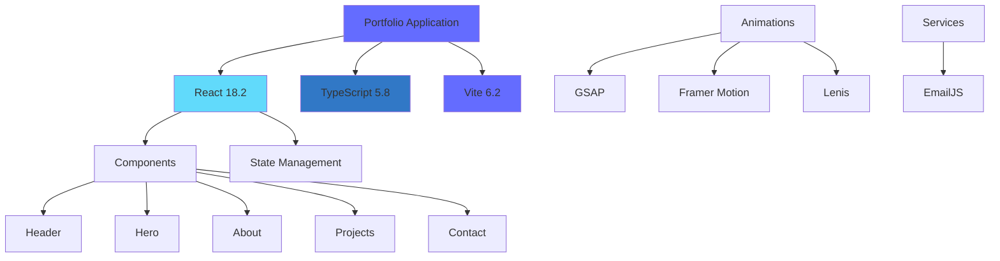
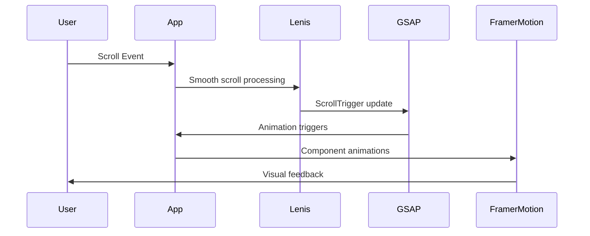

# Portfolio — Thien Phuc

<div align="center">


A high-end, minimalist portfolio website featuring bold typography, smooth animations, and a dark aesthetic. Built with React, TypeScript, and modern web technologies.

[Live Demo](#) • [Documentation](#) • [Report Bug](#)

</div>

---

## 📖 Introduction

This is a professional portfolio website showcasing work, expertise, and professional background. The site combines cutting-edge web technologies with elegant design principles to deliver an immersive user experience.

The portfolio features multiple sections including hero introduction, about section, career story, project showcase, skills/releases, and a contact form with EmailJS integration.

### Design Philosophy

- **Minimalist & Bold**: Clean design with strong typographic hierarchy
- **Smooth Interactions**: Butter-smooth scrolling and animations powered by GSAP and Framer Motion
- **Performance First**: Optimized builds with Vite for fast loading times
- **Responsive**: Seamless experience across all device sizes

---

## ✨ Key Features

### 🎨 User Interface

- **Custom Cursor**: Interactive cursor that enhances user engagement
- **Smooth Scrolling**: Buttery-smooth scroll experience powered by Lenis
- **Animated Transitions**: Fluid animations using GSAP and Framer Motion
- **Responsive Design**: Fully responsive across desktop, tablet, and mobile devices
- **Dark Theme**: Sleek dark aesthetic with carefully chosen color palette

### 📱 Sections

- **Hero Section**: Eye-catching introduction with parallax effects
- **About**: Personal and professional introduction
- **Story**: Career journey and background
- **Projects**: Interactive project showcase with filtering and detailed views
- **Releases/Skills**: Expertise and technical skills presentation
- **Contact**: Functional contact form with EmailJS integration

### 🔧 Technical Features

- **TypeScript**: Full type safety for better developer experience
- **Modern Build Tool**: Vite for lightning-fast development and builds
- **Email Integration**: EmailJS for contact form submissions
- **Animation Libraries**: GSAP ScrollTrigger and Framer Motion for advanced animations
- **Video Support**: Integrated video player component

---

## 🏗️ Overall Architecture

### Technology Stack



### Component Architecture

```
App
├── CustomCursor      # Custom cursor component
├── Header            # Navigation header
├── Menu              # Mobile/overlay menu
└── Main Sections
    ├── Hero          # Landing section with parallax
    ├── About         # About section
    ├── Story         # Career story
    ├── Projects      # Project showcase with modal
    ├── Releases      # Skills/expertise showcase
    └── Contact       # Contact form with EmailJS
```

### Animation Flow



---

## 🚀 Installation

### Prerequisites

Before you begin, ensure you have the following installed:

- **Node.js** 18.x or higher ([Download](https://nodejs.org/))
- **npm** 9.x or higher (comes with Node.js)
- **Git** ([Download](https://git-scm.com/))

### Clone the Repository

```bash
# Clone the repository
git clone https://github.com/yourusername/portfolio.git

# Navigate to the project directory
cd portfolio
```

### Install Dependencies

```bash
# Install all dependencies
npm install
```

This will install all required packages including:

- `react` & `react-dom` - React library
- `typescript` - TypeScript compiler
- `vite` - Build tool and dev server
- `@emailjs/browser` - Email service integration
- `gsap` - Animation library
- `framer-motion` - React animation library
- `@studio-freight/lenis` - Smooth scrolling library

---

## 🏃 Running the Project

### Development Mode

Start the development server with hot module replacement:

```bash
npm run dev
```

The application will be available at:

- **Local**: `http://localhost:3000`
- **Network**: `http://0.0.0.0:3000` (accessible from other devices on your network)

### Production Build

Create an optimized production build:

```bash
npm run build
```

The built files will be in the `dist` directory.

### Preview Production Build

Preview the production build locally:

```bash
npm run preview
```

This serves the production build using Vite's preview server.

---

## ⚙️ Environment Configuration

The project uses environment variables for configuration, particularly for EmailJS integration.

### Create Environment File

Create a `.env` file in the root directory:

```bash
# Copy the example (if available) or create new
touch .env
```

### Environment Variables

Add the following variables to your `.env` file:

```env
# EmailJS Configuration
# Get these from https://dashboard.emailjs.com/admin

# EmailJS Service ID
VITE_EMAILJS_SERVICE_ID=service_your_service_id

# EmailJS Template ID (for auto-reply to users)
VITE_EMAILJS_TEMPLATE_ID=template_your_template_id

# EmailJS Owner Template ID (optional, for notifications to you)
VITE_EMAILJS_OWNER_TEMPLATE_ID=template_your_owner_template_id

# EmailJS Public Key
VITE_EMAILJS_PUBLIC_KEY=your_public_key

# Optional: Gemini API Key (if using AI features)
GEMINI_API_KEY=your_gemini_api_key
```

### Getting EmailJS Credentials

1. **Create an EmailJS Account**: Sign up at [EmailJS](https://www.emailjs.com/)

2. **Create a Service**:
   - Go to [Email Services](https://dashboard.emailjs.com/admin/integration)
   - Add a new service (Gmail, Outlook, etc.)
   - Copy the **Service ID**

3. **Create Email Templates**:
   - Go to [Email Templates](https://dashboard.emailjs.com/admin/template)
   - Create a template for auto-reply (sent to users)
   - Optionally create a template for owner notifications
   - Copy the **Template IDs**

4. **Get Public Key**:
   - Go to [Account](https://dashboard.emailjs.com/admin) → API Keys
   - Copy the **Public Key**

### Example Configuration

```env
VITE_EMAILJS_SERVICE_ID=service_a7ixd56
VITE_EMAILJS_TEMPLATE_ID=template_17nvhcr
VITE_EMAILJS_OWNER_TEMPLATE_ID=template_7lzk2dd
VITE_EMAILJS_PUBLIC_KEY=5qmo2FFCXbyrB0jfQ
```

### Important Notes

- ⚠️ **Never commit** `.env` files to version control (already in `.gitignore`)
- 🔒 The public key is safe to use in frontend code (it's designed for public use)
- 📧 See [EMAILJS_FIX_GUIDE.md](./EMAILJS_FIX_GUIDE.md) for detailed EmailJS setup instructions

---

## 📁 Folder Structure

```
portfolio/
├── components/           # React components
│   ├── About.tsx        # About section component
│   ├── Contact.tsx      # Contact form with EmailJS
│   ├── CustomCursor.tsx # Custom cursor component
│   ├── Header.tsx       # Navigation header
│   ├── Hero.tsx         # Hero/landing section
│   ├── Menu.tsx         # Mobile/overlay menu
│   ├── Projects.tsx     # Project showcase
│   ├── Releases.tsx     # Skills/expertise section
│   ├── Story.tsx        # Career story section
│   ├── VideoPlayer.tsx  # Video player component
│   └── img/             # Component images
│       └── avt.jpg      # Avatar/hero image
│
├── contexts/            # React contexts (if any)
│
├── dist/                # Production build output (generated)
│   ├── assets/          # Compiled JS/CSS assets
│   └── index.html       # Production HTML
│
├── node_modules/        # Dependencies (generated)
│
├── App.tsx              # Main App component
├── index.tsx            # Application entry point
├── index.html           # HTML template
├── vite.config.ts       # Vite configuration
├── tsconfig.json        # TypeScript configuration
├── types.ts             # TypeScript type definitions
├── vite-env.d.ts        # Vite type definitions
├── metadata.json        # Project metadata
├── package.json         # Project dependencies and scripts
├── package-lock.json    # Locked dependency versions
├── .gitignore           # Git ignore rules
├── .env                 # Environment variables (create this)
├── .env.local           # Local environment overrides (optional)
├── EMAILJS_FIX_GUIDE.md # EmailJS setup guide
└── README.md            # This file
```

### Key Files Explained

| File | Purpose |
|------|---------|
| `App.tsx` | Main application component, sets up routing and global state |
| `index.tsx` | React app entry point, renders App component |
| `vite.config.ts` | Vite build configuration, aliases, server settings |
| `tsconfig.json` | TypeScript compiler options and paths |
| `package.json` | Project metadata, dependencies, and npm scripts |
| `.gitignore` | Files and folders to exclude from version control |

---

## 🤝 Contribution Guidelines

We welcome contributions! Whether it's bug fixes, new features, or documentation improvements, your help is appreciated.

### Getting Started

1. **Fork the Repository**
   ```bash
   # Click the "Fork" button on GitHub
   ```

2. **Clone Your Fork**
   ```bash
   git clone https://github.com/yourusername/portfolio.git
   cd portfolio
   ```

3. **Create a Branch**
   ```bash
   git checkout -b feature/your-feature-name
   # or
   git checkout -b fix/your-bug-fix
   ```

4. **Make Your Changes**
   - Write clean, readable code
   - Follow existing code style
   - Add comments for complex logic
   - Update documentation if needed

5. **Test Your Changes**
   ```bash
   npm run dev    # Test in development
   npm run build  # Ensure production build works
   ```

6. **Commit Your Changes**
   ```bash
   git add .
   git commit -m "feat: add new feature"  # or "fix: fix bug"
   ```

   Follow [Conventional Commits](https://www.conventionalcommits.org/):
   - `feat:` - New feature
   - `fix:` - Bug fix
   - `docs:` - Documentation changes
   - `style:` - Code style changes (formatting)
   - `refactor:` - Code refactoring
   - `perf:` - Performance improvements
   - `test:` - Adding or updating tests

7. **Push to Your Fork**
   ```bash
   git push origin feature/your-feature-name
   ```

8. **Create a Pull Request**
   - Go to the original repository on GitHub
   - Click "New Pull Request"
   - Select your fork and branch
   - Fill out the PR template with details about your changes

### Code Style Guidelines

- **TypeScript**: Use TypeScript for all new code
- **Components**: Use functional components with hooks
- **Naming**: Use PascalCase for components, camelCase for functions/variables
- **Formatting**: Let your editor auto-format (Prettier recommended)
- **Comments**: Add comments for complex logic, not obvious code

### Before Submitting

- ✅ Code builds without errors (`npm run build`)
- ✅ No TypeScript errors
- ✅ Follows existing code style
- ✅ Documentation updated (if applicable)
- ✅ Tested in development mode

---

## 📄 License

This project is licensed under the MIT License - see the [LICENSE](LICENSE) file for details (if available).

### MIT License Summary

- ✅ Commercial use
- ✅ Modification
- ✅ Distribution
- ✅ Private use

For full license details, please refer to the LICENSE file.

---

## 🗺️ Roadmap

### Current Version: 0.0.0

### Short Term (Q1 2024)

- [ ] **Performance Optimization**
  - [ ] Implement code splitting
  - [ ] Optimize image loading with lazy loading
  - [ ] Add service worker for offline support

- [ ] **Enhanced Features**
  - [ ] Add blog section
  - [ ] Implement dark/light theme toggle
  - [ ] Add multi-language support (i18n)

- [ ] **Contact Form Improvements**
  - [ ] Add form validation
  - [ ] Implement reCAPTCHA
  - [ ] Add email notification preferences

### Medium Term (Q2-Q3 2024)

- [ ] **Content Management**
  - [ ] Integrate headless CMS (Contentful/Sanity)
  - [ ] Admin panel for content updates
  - [ ] Dynamic project management

- [ ] **Analytics & SEO**
  - [ ] Google Analytics integration
  - [ ] Enhanced SEO metadata
  - [ ] Open Graph tags
  - [ ] Sitemap generation

- [ ] **Testing**
  - [ ] Unit tests with Vitest
  - [ ] Component tests with React Testing Library
  - [ ] E2E tests with Playwright

### Long Term (Q4 2024+)

- [ ] **Advanced Features**
  - [ ] 3D animations with Three.js
  - [ ] Interactive project demos
  - [ ] Real-time collaboration features

- [ ] **Infrastructure**
  - [ ] CI/CD pipeline setup
  - [ ] Automated deployments
  - [ ] Performance monitoring
  - [ ] Error tracking (Sentry)

### Ideas & Future Considerations

- 🎨 Customizable themes
- 📱 Progressive Web App (PWA) features
- 🎥 Enhanced video player with playlists
- 📊 Portfolio analytics dashboard
- 🔍 Advanced search functionality

---

## 📞 Support

### Getting Help

- 📖 **Documentation**: Check this README and inline code comments
- 🐛 **Bug Reports**: Open an issue on GitHub
- 💬 **Questions**: Start a discussion in GitHub Discussions
- 📧 **Email**: Contact via the portfolio contact form

### Common Issues

#### EmailJS Not Working

See [EMAILJS_FIX_GUIDE.md](./EMAILJS_FIX_GUIDE.md) for detailed troubleshooting.

**Quick Fix Checklist:**
- ✅ Environment variables set correctly
- ✅ EmailJS templates configured
- ✅ Service connected to email provider
- ✅ Template "To Email" field has a value

#### Build Errors

```bash
# Clear node_modules and reinstall
rm -rf node_modules package-lock.json
npm install

# Clear Vite cache
rm -rf dist node_modules/.vite
npm run dev
```

#### TypeScript Errors

```bash
# Ensure TypeScript is up to date
npm install --save-dev typescript@latest

# Check for type errors
npx tsc --noEmit
```

---

## 🙏 Acknowledgments

- **Design Inspiration**: Inspired by arocksworld.com
- **Animation Libraries**: GSAP, Framer Motion, Lenis
- **Build Tool**: Vite team for an excellent dev experience
- **Email Service**: EmailJS for seamless email integration

---

## 📊 Project Status


---

<div align="center">

**Built with ❤️ by Thien Phuc**

⭐ Star this repo if you find it helpful!

[↑ Back to Top](#portfolio--thien-phuc)

</div>
