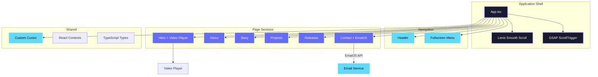

# THIEN PHUC® — Portfolio

<div align="center">

[](https://reactjs.org/)
[](https://www.typescriptlang.org/)
[](https://vitejs.dev/)
[](https://thienphuc2025.vercel.app/)
[](LICENSE)

A high-performance, animation-driven personal portfolio built with **React**, **TypeScript**, and **Vite**.  
Designed with a premium dark aesthetic and cinematic motion system.

[**🌐 Live Demo**](https://thienphuc2025.vercel.app/) · [**🐛 Report Bug**](../../issues) · [**💡 Request Feature**](../../issues)

</div>

---

## Table of Contents

- [Introduction](#introduction)
- [Key Features](#key-features)
- [Architecture](#architecture)
- [Tech Stack](#tech-stack)
- [Getting Started](#getting-started)
  - [Prerequisites](#prerequisites)
  - [Installation](#installation)
  - [Environment Variables](#environment-variables)
  - [Running Locally](#running-locally)
- [Project Structure](#project-structure)
- [Deployment](#deployment)
- [Roadmap](#roadmap)
- [Contributing](#contributing)
- [License](#license)

---

## Introduction

**THIEN PHUC® Portfolio** is a personal portfolio website that goes beyond a static résumé page. It is engineered as a **cinematic, immersive experience** — combining bold typography, smooth scroll physics, coordinated GSAP & Framer Motion animations, and a glassmorphism-inspired dark UI.

The project is built with a **developer-first** philosophy: fully typed with TypeScript, modular component architecture, and optimized for both desktop and mobile performance.

### Design Principles

| Principle | Description |
|---|---|
| **Immersive Experience** | Lenis smooth scroll, parallax layers, and scroll-triggered animations create a "living" interface |
| **Premium Aesthetic** | Dark mode, noise texture overlay, bold Montserrat typography, and JetBrains Mono for accents |
| **Performance First** | Vite-powered builds, lazy animations, and optimized asset loading for sub-second TTI |
| **Fully Responsive** | Fluid layouts from 4K displays down to mobile devices with zero horizontal overflow |

---

## Key Features

### 🎨 Frontend & UI

- **Cinematic Motion System** — Coordinated animations powered by [GSAP](https://greensock.com/gsap/) ScrollTrigger and [Framer Motion](https://www.framer.com/motion/), delivering smooth scroll-triggered transitions across all sections
- **Smooth Scroll Physics** — [Lenis](https://github.com/darkroomengineering/lenis) smooth scrolling with custom easing curves for a native-app feel
- **Custom Interactive Cursor** — Context-aware custom cursor that reacts to hoverable elements
- **Integrated Video Player** — Embedded video player in the Hero section with custom controls
- **Glassmorphism Design** — Layered glass effects, noise texture overlay, and subtle opacity animations
- **Responsive Navigation** — Fullscreen overlay menu with animated transitions and section-based navigation

### 📧 Contact System

- **Dual Email System** — Powered by [EmailJS](https://www.emailjs.com/):
  - **Auto-Reply** — Sends a confirmation email to the visitor
  - **Owner Notification** — Sends a detailed notification to the portfolio owner
- **Client-Side Validation** — Form validation with real-time feedback
- **No Backend Required** — Direct email delivery from the browser

### 🧩 Developer Experience

- **TypeScript** throughout — Strict typing for all components, props, and data structures
- **Path Aliases** — Clean imports via `@/`, `@components/`, `@contexts/`, `@types/`
- **Modular Architecture** — Each section is a self-contained component with its own animation logic
- **Hot Module Replacement** — Instant feedback during development via Vite HMR

---

## Architecture

The application follows a **component-driven architecture** where each page section is an isolated React component with its own animation lifecycle managed by GSAP ScrollTrigger.



### Scroll & Animation Flow

```
User Scrolls
    │
    ▼
┌──────────────────┐
│  Lenis (Physics)  │  ← Smooth scroll with custom easing
└────────┬─────────┘
         │
         ▼
┌──────────────────┐
│  GSAP ScrollTrigger │  ← Trigger animations based on scroll position
└────────┬─────────┘
         │
    ┌────┴────┐
    ▼         ▼
┌────────┐ ┌──────────────┐
│  GSAP  │ │ Framer Motion │  ← Orchestrated animations per section
└────────┘ └──────────────┘
```

---

## Tech Stack

### Core

| Technology | Version | Purpose |
|---|---|---|
| [React](https://reactjs.org/) | `18.2.0` | Component-based UI library |
| [TypeScript](https://www.typescriptlang.org/) | `5.8.2` | Static type checking |
| [Vite](https://vitejs.dev/) | `6.2.0` | Build tool & development server |

### Animation & Interaction

| Technology | Version | Purpose |
|---|---|---|
| [GSAP](https://greensock.com/gsap/) | `3.14.2` | Advanced scroll-triggered animations |
| [Framer Motion](https://www.framer.com/motion/) | `11.11.11` | Declarative React animations & transitions |
| [Lenis](https://github.com/darkroomengineering/lenis) | `1.0.42` | Smooth scroll physics engine |

### Utilities

| Technology | Purpose |
|---|---|
| [EmailJS](https://www.emailjs.com/) | Client-side email delivery |
| [Lucide React](https://lucide.dev/) | SVG icon library |
| [TailwindCSS (CDN)](https://tailwindcss.com/) | Utility-first CSS |
| [Google Fonts](https://fonts.google.com/) | Montserrat + JetBrains Mono |

### Infrastructure

| Service | Purpose |
|---|---|
| [Vercel](https://vercel.com/) | Hosting, CI/CD, Edge Network |
| [GitHub](https://github.com/) | Source control & collaboration |

---

## Getting Started

### Prerequisites

| Requirement | Minimum Version |
|---|---|
| [Node.js](https://nodejs.org/) | `18.x` or later |
| [npm](https://www.npmjs.com/) | `9.x` or later |
| A modern browser | Chrome, Firefox, Safari, or Edge |

### Installation

```bash
# 1. Clone the repository
git clone https://github.com/phuc2502/portfolio_thienphuc.git
cd portfolio_thienphuc

# 2. Install dependencies
npm install
```

### Environment Variables

Create a `.env.local` file in the project root:

```env
# ===== EmailJS Configuration (Required for Contact Form) =====
VITE_EMAILJS_SERVICE_ID=your_service_id
VITE_EMAILJS_TEMPLATE_ID=your_template_id
VITE_EMAILJS_PUBLIC_KEY=your_public_key

# ===== EmailJS Owner Notification (Optional) =====
VITE_EMAILJS_OWNER_TEMPLATE_ID=your_owner_template_id
```

<details>
<summary><strong>📝 How to get EmailJS credentials</strong></summary>

1. Sign up at [emailjs.com](https://www.emailjs.com/)
2. Create an **Email Service** → copy `Service ID`
3. Create an **Email Template** → copy `Template ID`
4. Go to **Account** → **API Keys** → copy `Public Key`

**Template variables used:**

| Variable | Description |
|---|---|
| `{{email}}` | Sender's email address |
| `{{name}}` | Sender's name |
| `{{from_name}}` | Sender's display name |
| `{{message}}` | Message content |
| `{{reply_to}}` | Reply-to address |

</details>

### Running Locally

```bash
# Start the development server
npm run dev
```

The application will be available at **http://localhost:3000**.

#### Available Scripts

| Command | Description |
|---|---|
| `npm run dev` | Start Vite dev server with HMR at `localhost:3000` |
| `npm run build` | Create optimized production build in `dist/` |
| `npm run preview` | Preview production build locally |

---

## Project Structure

```text
portfolio_thienphuc/
├── index.html                  # HTML entry point (includes Tailwind CDN, fonts, global styles)
├── vite.config.ts              # Vite configuration (aliases, port, plugins)
├── tsconfig.json               # TypeScript compiler options
├── package.json                # Project metadata & dependencies
├── .env.local                  # Environment variables (git-ignored)
├── .gitignore                  # Git ignore rules
├── LICENSE                     # MIT License
│
├── src/                        # ─── Application Source ───
│   ├── index.tsx               # React DOM entry point
│   ├── App.tsx                 # Root component: layout, scroll engine, routing
│   ├── vite-env.d.ts           # Vite environment type declarations
│   │
│   ├── components/             # ─── UI Components ───
│   │   ├── Header.tsx          # Top navigation bar
│   │   ├── Menu.tsx            # Fullscreen overlay menu with navigation
│   │   ├── Hero.tsx            # Hero section with video integration
│   │   ├── HeroVideoPlayer.tsx # Video player embedded in Hero
│   │   ├── VideoPlayer.tsx     # Reusable video player component
│   │   ├── About.tsx           # Personal introduction section
│   │   ├── Story.tsx           # Career journey / personal story
│   │   ├── Projects.tsx        # Featured projects showcase
│   │   ├── Releases.tsx        # Achievements & milestones
│   │   ├── Contact.tsx         # Contact form (EmailJS integration)
│   │   ├── CustomCursor.tsx    # Interactive custom cursor
│   │   └── img/                # Component-specific images
│   │
│   ├── contexts/               # React Context providers (global state)
│   └── types/                  # Shared TypeScript interfaces & types
│
├── public/                     # Static assets served at root
├── scripts/                    # Build & utility scripts
├── docs/                       # Project documentation
└── dist/                       # Production build output (git-ignored)
```

---

## Deployment

The project is configured for seamless deployment on **[Vercel](https://vercel.com/)**.

### Deploy to Vercel

1. Import the repository at [vercel.com/new](https://vercel.com/new)
2. Add environment variables under **Settings → Environment Variables**:

   | Variable | Value |
   |---|---|
   | `VITE_EMAILJS_SERVICE_ID` | Your EmailJS Service ID |
   | `VITE_EMAILJS_TEMPLATE_ID` | Your EmailJS Template ID |
   | `VITE_EMAILJS_PUBLIC_KEY` | Your EmailJS Public Key |
   | `VITE_EMAILJS_OWNER_TEMPLATE_ID` | Your owner notification Template ID |

3. Deploy — Vercel auto-builds on every push to `main`

> **⚠️ Important:** `.env.local` is git-ignored. You **must** configure environment variables in the Vercel dashboard for the contact form to work in production.

### Troubleshooting

| Issue | Cause | Solution |
|---|---|---|
| Contact form not sending emails | Missing env variables on Vercel | Add `VITE_EMAILJS_*` variables in Vercel Settings |
| Form returns 400 error | Invalid Template ID | Verify Template ID matches EmailJS dashboard |
| Blank page after deploy | Build error or missing dependency | Check Vercel build logs in Deployments tab |
| Env variables not applied | Deployment not refreshed | Trigger manual redeploy after adding variables |

---

## Roadmap

- [x] Premium dark UI with GSAP + Framer Motion animation system
- [x] Lenis smooth scroll integration
- [x] EmailJS contact form with auto-reply & owner notification
- [x] Custom interactive cursor
- [x] Hero video player
- [x] Vercel production deployment
- [ ] Internationalization (i18n) — English / Vietnamese toggle
- [ ] 3D scene integration with Three.js / React Three Fiber
- [ ] Real-time analytics dashboard
- [ ] Blog / writing section with MDX support
- [ ] Performance monitoring with Web Vitals

---

## Contributing

Contributions are welcome! Follow these steps:

### 1. Fork & Clone

```bash
git clone https://github.com/<your-username>/portfolio_thienphuc.git
cd portfolio_thienphuc
npm install
```

### 2. Create a Feature Branch

```bash
git checkout -b feature/your-feature-name
```

### 3. Make Changes & Commit

Follow [Conventional Commits](https://www.conventionalcommits.org/) for commit messages:

```bash
git commit -m "feat: add dark mode toggle"
git commit -m "fix: resolve scroll offset on mobile"
git commit -m "docs: update environment setup guide"
```

### 4. Push & Open a Pull Request

```bash
git push origin feature/your-feature-name
```

Then open a Pull Request on GitHub with a clear description of your changes.

### Code Guidelines

- Ensure `npm run build` passes with **zero errors**
- Follow existing code style and naming conventions
- Keep components focused and self-contained
- Add TypeScript types for all new props and data structures

---

## License

This project is distributed under the **MIT License**. See the [LICENSE](LICENSE) file for details.

```
MIT License — Copyright (c) 2024 Thien Phuc
```

---

<div align="center">

**Built by [Thien Phuc](https://github.com/phuc2502)** · Hanoi, Vietnam

⭐ If you found this project useful, consider giving it a star on GitHub!

[↑ Back to top](#thien-phuc--portfolio)

</div>
