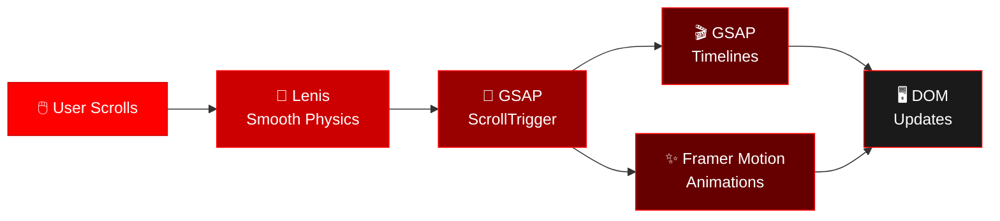

<div align="center">

# 🔴 THIEN PHUC® — Portfolio


<br />

[](https://reactjs.org/)
[](https://www.typescriptlang.org/)
[](https://vitejs.dev/)
[](https://greensock.com/gsap/)
[](https://thienphuc2025.vercel.app/)
[](LICENSE)

**A high-performance, animation-driven personal portfolio**
**built with React, TypeScript, and cinematic motion design.**

<br />

[🌐 **Live Demo**](https://thienphuc2025.vercel.app/) &nbsp;·&nbsp; [🐛 **Report Bug**](../../issues) &nbsp;·&nbsp; [💡 **Request Feature**](../../issues)

<br />


</div>

<br />

## 📑 Table of Contents

> 🔗 Quick navigation to all sections

- [🔶 Introduction](#-introduction)
- [⚡ Key Features](#-key-features)
- [🏗️ Architecture](#️-architecture)
- [🧰 Tech Stack](#-tech-stack)
- [🚀 Getting Started](#-getting-started)
- [📁 Project Structure](#-project-structure)
- [☁️ Deployment](#️-deployment)
- [🗺️ Roadmap](#️-roadmap)
- [🤝 Contributing](#-contributing)
- [📄 License](#-license)

---

## 🔶 Introduction

**THIEN PHUC® Portfolio** is not just another portfolio website — it's a **cinematic, immersive experience** engineered to leave a lasting impression. Every scroll, every transition, and every interaction is crafted with precision.

Built with a **developer-first** philosophy: fully typed with TypeScript, modular component architecture, and optimized for both desktop and mobile.

### 🎯 Design Philosophy

| | Principle | Description |
|---|---|---|
| 🎭 | **Immersive Experience** | Lenis smooth scroll, parallax layers, and scroll-triggered animations create a "living" interface |
| 🎨 | **Premium Aesthetic** | Dark mode, noise texture overlay, bold Montserrat typography, and JetBrains Mono for code accents |
| ⚡ | **Performance First** | Vite-powered builds, lazy animations, and optimized asset loading for sub-second TTI |
| 📱 | **Fully Responsive** | Fluid layouts from 4K displays down to mobile devices with zero horizontal overflow |

---

## ⚡ Key Features

### 🎨 Frontend & Visual Design

| Feature | Description |
|---|---|
| 🎬 **Cinematic Motion System** | Coordinated animations powered by GSAP ScrollTrigger + Framer Motion |
| 🌊 **Smooth Scroll Physics** | Lenis smooth scrolling with custom easing curves for a native-app feel |
| 🖱️ **Custom Interactive Cursor** | Context-aware cursor that reacts to hoverable elements |
| 🎥 **Integrated Video Player** | Embedded video player in the Hero section with custom controls |
| 🪟 **Glassmorphism UI** | Layered glass effects, noise texture overlay, and opacity animations |
| 📍 **Section Navigation** | Fullscreen overlay menu with animated transitions |

### 📧 Contact System

| Feature | Description |
|---|---|
| 📨 **Auto-Reply Email** | Sends a confirmation email to the visitor via EmailJS |
| 🔔 **Owner Notification** | Sends a detailed notification to the portfolio owner |
| ✅ **Client-Side Validation** | Real-time form validation with visual feedback |
| 🚫 **No Backend Needed** | Direct email delivery from the browser |

### 🛠️ Developer Experience

| Feature | Description |
|---|---|
| 🔒 **TypeScript Everywhere** | Strict typing for all components, props, and data structures |
| 🧭 **Path Aliases** | Clean imports via `@/`, `@components/`, `@contexts/`, `@types/` |
| 📦 **Modular Architecture** | Each section is a self-contained component with its own animation lifecycle |
| 🔥 **Hot Module Replacement** | Instant feedback during development via Vite HMR |

---

## 🏗️ Architecture

The application follows a **component-driven architecture** where each page section is an isolated React component with its own animation lifecycle managed by GSAP ScrollTrigger.

```mermaid
graph TD
    subgraph "🔴 Application Shell"
        App["⚙️ App.tsx"]
        Lenis["🌊 Lenis Smooth Scroll"]
        GSAP["🎬 GSAP ScrollTrigger"]
    end

    subgraph "🔴 Navigation"
        Header["📍 Header"]
        Menu["📋 Fullscreen Menu"]
    end

    subgraph "🔴 Page Sections"
        Hero["🎥 Hero + Video Player"]
        About["👤 About"]
        Story["📖 Story"]
        Projects["💼 Projects"]
        Releases["🏆 Releases"]
        Contact["📧 Contact + EmailJS"]
    end

    subgraph "🔴 Shared"
        Cursor["🖱️ Custom Cursor"]
        Context["🧠 React Contexts"]
        Types["📝 TypeScript Types"]
    end

    App --> Lenis
    App --> GSAP
    App --> Header
    App --> Menu
    App --> Hero
    App --> About
    App --> Story
    App --> Projects
    App --> Releases
    App --> Contact
    App --> Cursor

    Contact -->|"📨 EmailJS API"| Email["📬 Email Service"]
    Hero --> VideoPlayer["🎥 Video Player"]

    classDef primary fill:#CC0000,stroke:#FF0000,stroke-width:2px,color:#fff
    classDef accent fill:#1a1a1a,stroke:#FF0000,stroke-width:1px,color:#fff
    classDef shell fill:#0a0a0a,stroke:#FF0000,stroke-width:2px,color:#fff

    class App,Lenis,GSAP shell
    class Hero,About,Story,Projects,Releases,Contact primary
    class Header,Menu,Cursor,Email,VideoPlayer accent
```



### 🔄 Scroll & Animation Pipeline



---

## 🧰 Tech Stack

### 🔴 Core

| | Technology | Version | Purpose |
|---|---|---|---|
| ⚛️ | [React](https://reactjs.org/) | `18.2.0` | Component-based UI library |
| 🔷 | [TypeScript](https://www.typescriptlang.org/) | `5.8.2` | Static type checking |
| ⚡ | [Vite](https://vitejs.dev/) | `6.2.0` | Build tool & development server |

### 🔴 Animation & Interaction

| | Technology | Version | Purpose |
|---|---|---|---|
| 🎬 | [GSAP](https://greensock.com/gsap/) | `3.14.2` | Advanced scroll-triggered animations |
| ✨ | [Framer Motion](https://www.framer.com/motion/) | `11.11.11` | Declarative React animations & transitions |
| 🌊 | [Lenis](https://github.com/darkroomengineering/lenis) | `1.0.42` | Smooth scroll physics engine |

### 🔴 Utilities & Services

| | Technology | Purpose |
|---|---|---|
| 📧 | [EmailJS](https://www.emailjs.com/) | Client-side email delivery |
| 🎨 | [Lucide React](https://lucide.dev/) | SVG icon library |
| 💅 | [TailwindCSS (CDN)](https://tailwindcss.com/) | Utility-first CSS framework |
| 🔤 | [Google Fonts](https://fonts.google.com/) | Montserrat + JetBrains Mono typography |

### 🔴 Infrastructure

| | Service | Purpose |
|---|---|---|
| ▲ | [Vercel](https://vercel.com/) | Hosting, CI/CD, Edge Network |
| 🐙 | [GitHub](https://github.com/) | Source control & collaboration |

---

## 🚀 Getting Started

### 📋 Prerequisites

| | Requirement | Minimum Version |
|---|---|---|
| 🟢 | [Node.js](https://nodejs.org/) | `18.x` or later |
| 📦 | [npm](https://www.npmjs.com/) | `9.x` or later |
| 🌐 | Modern browser | Chrome, Firefox, Safari, or Edge |

### 📥 Installation

```bash
# 1️⃣ Clone the repository
git clone https://github.com/phuc2502/portfolio_thienphuc.git
cd portfolio_thienphuc

# 2️⃣ Install dependencies
npm install
```

### 🔑 Environment Variables

Create a `.env.local` file in the project root:

```env
# ━━━ 📧 EmailJS Configuration (Required for Contact Form) ━━━
VITE_EMAILJS_SERVICE_ID=your_service_id
VITE_EMAILJS_TEMPLATE_ID=your_template_id
VITE_EMAILJS_PUBLIC_KEY=your_public_key

# ━━━ 🔔 EmailJS Owner Notification (Optional) ━━━
VITE_EMAILJS_OWNER_TEMPLATE_ID=your_owner_template_id
```

<details>
<summary>📝 <strong>How to get EmailJS credentials</strong></summary>

<br />

1. 🔗 Sign up at [emailjs.com](https://www.emailjs.com/)
2. ➕ Create an **Email Service** → copy `Service ID`
3. 📄 Create an **Email Template** → copy `Template ID`
4. 🔑 Go to **Account** → **API Keys** → copy `Public Key`

**Template variables used in this project:**

| Variable | Description |
|---|---|
| `{{email}}` | 📧 Sender's email address |
| `{{name}}` | 👤 Sender's name |
| `{{from_name}}` | 🏷️ Sender's display name |
| `{{message}}` | 💬 Message content |
| `{{reply_to}}` | ↩️ Reply-to address |

</details>

### ▶️ Running the Project

```bash
# 🔥 Start the development server
npm run dev
```

> 🌐 The application will be available at **http://localhost:3000**

### 📜 Available Commands

| Command | Description |
|---|---|
| 🔥 `npm run dev` | Start Vite dev server with HMR at `localhost:3000` |
| 📦 `npm run build` | Create optimized production build in `dist/` |
| 👁️ `npm run preview` | Preview production build locally |

---

## 📁 Project Structure

```text
portfolio_thienphuc/
│
├── 🌐 index.html                # HTML entry point (Tailwind CDN, fonts, global styles)
├── ⚙️ vite.config.ts             # Vite configuration (aliases, port, plugins)
├── 🔷 tsconfig.json              # TypeScript compiler options
├── 📦 package.json               # Project metadata & dependencies
├── 🔑 .env.local                 # Environment variables (git-ignored)
├── 🚫 .gitignore                 # Git ignore rules
├── 📄 LICENSE                    # MIT License
│
├── 📂 src/                       # ━━━ APPLICATION SOURCE ━━━
│   ├── 🚀 index.tsx              # React DOM entry point
│   ├── ⚙️ App.tsx                 # Root: layout, scroll engine, navigation
│   ├── 📝 vite-env.d.ts          # Vite environment type declarations
│   │
│   ├── 📂 components/            # ━━━ UI COMPONENTS ━━━
│   │   ├── 📍 Header.tsx         # Top navigation bar
│   │   ├── 📋 Menu.tsx           # Fullscreen overlay menu
│   │   ├── 🎥 Hero.tsx           # Hero section with video
│   │   ├── 🎬 HeroVideoPlayer.tsx # Video player for Hero
│   │   ├── ▶️ VideoPlayer.tsx     # Reusable video player
│   │   ├── 👤 About.tsx          # Personal introduction
│   │   ├── 📖 Story.tsx          # Career journey
│   │   ├── 💼 Projects.tsx       # Featured projects showcase
│   │   ├── 🏆 Releases.tsx       # Achievements & milestones
│   │   ├── 📧 Contact.tsx        # Contact form (EmailJS)
│   │   ├── 🖱️ CustomCursor.tsx   # Interactive custom cursor
│   │   └── 🖼️ img/               # Component-specific images
│   │
│   ├── 📂 contexts/              # 🧠 React Context providers
│   └── 📂 types/                 # 📝 Shared TypeScript interfaces
│
├── 📂 public/                    # 🌐 Static assets served at root
├── 📂 scripts/                   # 🔧 Build & utility scripts
├── 📂 docs/                      # 📚 Project documentation
└── 📂 dist/                      # 📦 Production build output (git-ignored)
```

---

## ☁️ Deployment

The project is configured for seamless deployment on **[Vercel](https://vercel.com/)**.

### 🚀 Deploy to Vercel

**Step 1** — Import the repository at [vercel.com/new](https://vercel.com/new)

**Step 2** — Add environment variables under **Settings → Environment Variables**:

| | Variable | Value |
|---|---|---|
| 📧 | `VITE_EMAILJS_SERVICE_ID` | Your EmailJS Service ID |
| 📄 | `VITE_EMAILJS_TEMPLATE_ID` | Your EmailJS Template ID |
| 🔑 | `VITE_EMAILJS_PUBLIC_KEY` | Your EmailJS Public Key |
| 🔔 | `VITE_EMAILJS_OWNER_TEMPLATE_ID` | Your owner notification Template ID |

**Step 3** — Deploy! Vercel auto-builds on every push to `main` ✅

> ⚠️ **Important:** `.env.local` is git-ignored. You **must** configure environment variables in the Vercel dashboard for the contact form to work in production.

### 🔧 Troubleshooting

| | Issue | Cause | Solution |
|---|---|---|---|
| 🔴 | Contact form not sending | Missing env variables on Vercel | Add `VITE_EMAILJS_*` variables in Settings |
| 🔴 | Form returns 400 error | Invalid Template ID | Verify Template ID on EmailJS dashboard |
| 🔴 | Blank page after deploy | Build error | Check build logs in Deployments tab |
| 🔴 | Env variables not applied | Stale deployment | Trigger manual redeploy |

---

## 🗺️ Roadmap

### ✅ Completed

- [x] 🎨 Premium dark UI with GSAP + Framer Motion animation system
- [x] 🌊 Lenis smooth scroll integration
- [x] 📧 EmailJS contact form with auto-reply & owner notification
- [x] 🖱️ Custom interactive cursor
- [x] 🎥 Hero video player
- [x] ▲ Vercel production deployment

### 🔜 Upcoming

- [ ] 🌍 Internationalization (i18n) — English / Vietnamese toggle
- [ ] 🧊 3D scene integration with Three.js / React Three Fiber
- [ ] 📊 Real-time analytics dashboard
- [ ] ✍️ Blog / writing section with MDX support
- [ ] ⚡ Performance monitoring with Web Vitals

---

## 🤝 Contributing

Contributions are welcome! Here's how to get started:

### 1️⃣ Fork & Clone

```bash
git clone https://github.com/<your-username>/portfolio_thienphuc.git
cd portfolio_thienphuc
npm install
```

### 2️⃣ Create a Feature Branch

```bash
git checkout -b feature/your-feature-name
```

### 3️⃣ Make Changes & Commit

Follow [Conventional Commits](https://www.conventionalcommits.org/):

```bash
git commit -m "feat: add dark mode toggle"
git commit -m "fix: resolve scroll offset on mobile"
git commit -m "docs: update environment setup guide"
```

### 4️⃣ Push & Open a Pull Request

```bash
git push origin feature/your-feature-name
```

Then open a **Pull Request** on GitHub with a clear description.

### 📏 Code Guidelines

| | Rule |
|---|---|
| ✅ | Ensure `npm run build` passes with **zero errors** |
| ✅ | Follow existing code style and naming conventions |
| ✅ | Keep components focused and self-contained |
| ✅ | Add TypeScript types for all new props and data structures |
| ✅ | Test on both desktop and mobile viewports |

---

## 📄 License

This project is distributed under the **MIT License**.

```
MIT License — Copyright (c) 2024 Thien Phuc
```

See the [LICENSE](LICENSE) file for full details.

---

<div align="center">


<br /><br />

🔴 **Built with ❤️ by [Thien Phuc](https://github.com/phuc2502)** · Hanoi, Vietnam

⭐ **If you found this project useful, consider giving it a star on GitHub!**

<br />

[↑ Back to top](#-thien-phuc--portfolio)

</div>
