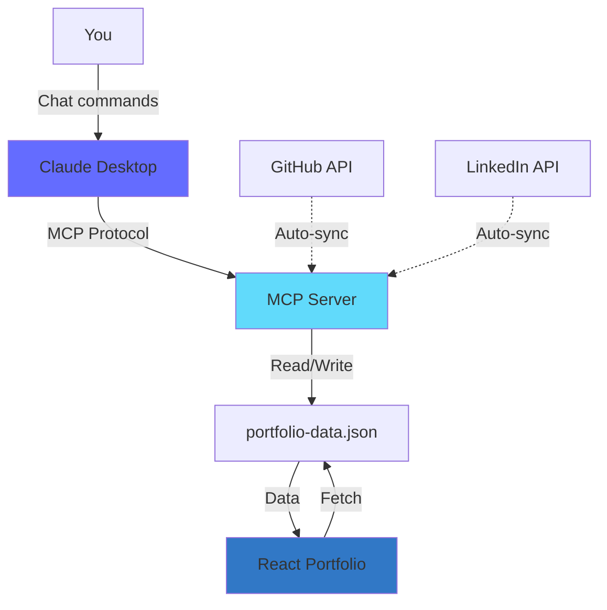

# MCP Integration Guide - Portfolio Website

## 📖 Hướng dẫn tích hợp MCP Server với Portfolio

MCP Server đã được tạo thành công! Bây giờ bạn có thể quản lý nội dung portfolio một cách động.

---

## 🎯 Những gì MCP Server cung cấp

### ✅ **Resources** (Dữ liệu có sẵn)
1. `portfolio://projects` - Danh sách tất cả projects
2. `portfolio://skills` - Danh sách skills
3. `portfolio://experiences` - Work experience history
4. `portfolio://metadata` - Thông tin version và update time

### ✅ **Tools** (Công cụ quản lý)
1. `add_project` - Thêm project mới
2. `update_project` - Cập nhật project
3. `delete_project` - Xóa project
4. `get_project` - Lấy chi tiết project
5. `add_skill` - Thêm skill mới
6. `add_experience` - Thêm work experience
7. `export_portfolio` - Export toàn bộ dữ liệu

---

## 🚀 Cách sử dụng với Claude Desktop

### **Bước 1: Cấu hình Claude Desktop**

Mở file config của Claude Desktop:
- **Windows**: `%APPDATA%\Claude\claude_desktop_config.json`
- **macOS**: `~/Library/Application Support/Claude/claude_desktop_config.json`

Thêm configuration sau:

```json
{
  "mcpServers": {
    "portfolio": {
      "command": "node",
      "args": ["d:\\portfolio_thienphuc\\mcp-server\\dist\\index.js"]
    }
  }
}
```

### **Bước 2: Restart Claude Desktop**

Sau khi lưu config, restart Claude Desktop để load MCP server.

### **Bước 3: Sử dụng MCP**

Bây giờ bạn có thể chat với Claude và yêu cầu:

**Xem dữ liệu:**
```
"Show me all my portfolio projects"
"What skills do I have?"
"Show my work experiences"
```

**Thêm mới:**
```
"Add a new project about AI chatbot with React and OpenAI"
"Add a skill: Python with Expert level, 5 years experience"
```

**Cập nhật:**
```
"Update project 01 with new demo URL"
"Change the year of Banking Core System to 2024"
```

**Export:**
```
"Export my entire portfolio as JSON"
```

---

## 🔗 Tích hợp với React Portfolio

Hiện tại, data đang được hard-code trong `components/Projects.tsx`. Để sử dụng dynamic data từ MCP:

### **Option A: API Endpoint (Recommended)**

Tạo một API endpoint đơn giản để serve portfolio data:

```typescript
// mcp-server/src/api.ts
import express from 'express';
import fs from 'fs/promises';
import path from 'path';

const app = express();
const PORT = 3001;
const DATA_FILE = path.join(__dirname, 'data', 'portfolio-data.json');

app.use(express.json());

// CORS
app.use((req, res, next) => {
  res.header('Access-Control-Allow-Origin', '*');
  next();
});

// Get all projects
app.get('/api/projects', async (req, res) => {
  const data = JSON.parse(await fs.readFile(DATA_FILE, 'utf-8'));
  res.json(data.projects);
});

// Get all skills
app.get('/api/skills', async (req, res) => {
  const data = JSON.parse(await fs.readFile(DATA_FILE, 'utf-8'));
  res.json(data.skills);
});

// Get all experiences
app.get('/api/experiences', async (req, res) => {
  const data = JSON.parse(await fs.readFile(DATA_FILE, 'utf-8'));
  res.json(data.experiences);
});

app.listen(PORT, () => {
  console.log(`API running on http://localhost:${PORT}`);
});
```

**Sau đó update React component:**

```typescript
// components/Projects.tsx
const [projects, setProjects] = useState<ProjectDetail[]>([]);

useEffect(() => {
  fetch('http://localhost:3001/api/projects')
    .then(res => res.json())
    .then(data => setProjects(data))
    .catch(err => console.error('Failed to load projects:', err));
}, []);
```

### **Option B: Direct Import (Simple)**

Import trực tiếp từ JSON file:

```typescript
// components/Projects.tsx
import portfolioData from '../mcp-server/src/data/portfolio-data.json';

const items: ProjectDetail[] = portfolioData.projects;
```

### **Option C: Build-time Generation**

Tạo một build script để copy data vào `public` folder:

```json
// package.json
{
  "scripts": {
    "prebuild": "node scripts/sync-portfolio-data.js",
    "build": "vite build"
  }
}
```

```javascript
// scripts/sync-portfolio-data.js
import fs from 'fs';
import path from 'path';

const source = path.join('mcp-server', 'src', 'data', 'portfolio-data.json');
const dest = path.join('public', 'portfolio-data.json');

fs.copyFileSync(source, dest);
console.log('✅ Portfolio data synced!');
```

---

## 📝 Example: Quản lý Projects với MCP

### **Thêm project mới:**

```typescript
// Trong Claude Desktop chat:
"Add a new project:
- ID: 04
- Title: E-COMMERCE PLATFORM
- Category: WEB
- Year: 2024
- Brief: A scalable e-commerce platform built with Next.js and Stripe
- Tech stack: Next.js, TypeScript, Stripe, PostgreSQL
- Outcomes: 
  - Sales: +150%
  - Load time: -40%
  - Conversion: +35%"
```

MCP sẽ tự động:
1. Validate data theo schema
2. Thêm vào `portfolio-data.json`
3. Update `lastUpdated` timestamp

### **Update project:**

```typescript
"Update project 01:
- Demo URL: https://new-demo-url.com
- Year: 2024"
```

### **Delete project:**

```typescript
"Delete project with ID 03"
```

---

## 🔄 Workflow hoàn chỉnh



---

## 🎨 Next Steps - Nâng cao

### 1. **GitHub Auto-Sync**
Tự động import repositories từ GitHub:
```typescript
// Add to MCP server
async function syncGitHub() {
  const repos = await fetch('https://api.github.com/users/phuc2502/repos');
  // Transform and add to portfolio
}
```

### 2. **Image Optimization**
Auto-optimize và host images:
```typescript
// Use Cloudinary or similar service
const optimizedUrl = await uploadToCloudinary(imageUrl);
```

### 3. **Analytics Integration**
Track project views và engagement:
```typescript
// Add analytics to portfolio-data.json
{
  "analytics": {
    "project-01": {
      "views": 1250,
      "clicks": 340
    }
  }
}
```

### 4. **Backup System**
Auto-backup portfolio data:
```bash
# Add to MCP server
npm run backup  # Creates timestamped backup
```

---

## ⚠️ Important Notes

1. **Data Safety**: File `portfolio-data.json` là source of truth. Nên backup thường xuyên.
2. **Validation**: Mọi data đều được validate bởi Zod schema trước khi save.
3. **Timestamps**: `lastUpdated` tự động cập nhật mỗi lần có thay đổi.
4. **CORS**: Nếu dùng API endpoint, nhớ configure CORS cho production.

---

## 🐛 Troubleshooting

### MCP Server không connect được
```bash
# Kiểm tra build
cd mcp-server
npm run build

# Test local
node dist/index.js
```

### Data không update
```bash
# Kiểm tra permissions
ls -la mcp-server/src/data/portfolio-data.json

# Validate JSON
cat mcp-server/src/data/portfolio-data.json | jq .
```

### React không load được data
```bash
# Check CORS nếu dùng API
# Check path nếu import trực tiếp
# Check network tab trong DevTools
```

---

## 📚 Resources

- [MCP Documentation](https://modelcontextprotocol.io/)
- [MCP SDK](https://github.com/modelcontextprotocol/sdk)
- [Zod Validation](https://zod.dev/)

---

**🎉 Chúc mừng! MCP Server của bạn đã sẵn sàng!**

Giờ bạn có thể quản lý portfolio content một cách động và intelligent với AI assistance từ Claude Desktop.
