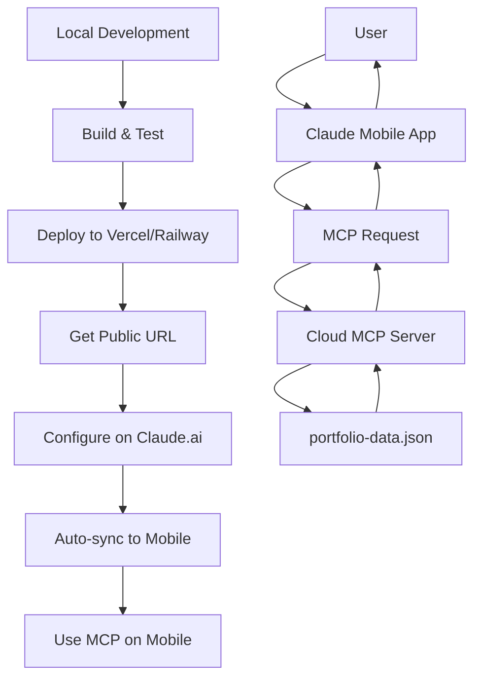

# 📱 Setup MCP trên Claude Mobile - Complete Guide

## 🎯 TÓM TẮT

**Câu trả lời nhanh:**
- ❌ **MCP local hiện tại KHÔNG thể dùng trên mobile**
- ✅ **Cần deploy lên cloud server** để sử dụng trên mobile
- ✅ **Config qua Claude.ai website** → tự động sync to mobile

---

## 🔍 2 LOẠI MCP - Hiểu rõ sự khác biệt

### **1. Local MCP (Hiện tại của bạn)** ⚡ Desktop Only

```
📁 d:\portfolio_thienphuc\mcp-server\
├─ Chạy trên: Máy tính Windows
├─ Giao tiếp: stdio (stdin/stdout)
├─ Sử dụng được:
│  ✅ Claude Desktop (local machine)
├─ KHÔNG dùng được:
│  ❌ Claude.ai website
│  ❌ Claude Mobile app
└─ Config: claude_desktop_config.json (local)
```

**Ưu điểm:**
- ⚡ Nhanh, không cần internet
- 🔒 Bảo mật, data ở local
- 🆓 Hoàn toàn miễn phí

**Nhược điểm:**
- ❌ Chỉ dùng trên máy tính có cài Claude Desktop
- ❌ Không dùng mobile
- ❌ Không dùng khi đi du lịch

---

### **2. Remote MCP (Để dùng mobile)** ☁️ Everywhere

```
☁️ Cloud Server (Vercel/Railway/AWS)
├─ Chạy trên: Internet (public URL)
├─ Giao tiếp: HTTP API / WebSocket
├─ Sử dụng được:
│  ✅ Claude.ai website
│  ✅ Claude Mobile app (iOS/Android)
│  ✅ Claude Desktop (nếu muốn)
├─ Config: Claude.ai Settings → Connectors
└─ Auto-sync: Tất cả devices
```

**Ưu điểm:**
- ✅ Dùng được mọi nơi (mobile, web, desktop)
- ✅ Sync tự động across devices
- ✅ Multi-user support

**Nhược điểm:**
- 💰 Có thể tốn phí (tùy platform)
- 🌐 Cần internet connection
- 🔧 Setup phức tạp hơn

---

## 🚀 CÁCH SETUP MCP TRÊN MOBILE (4 BƯỚC)

---

### **BƯỚC 1: Deploy MCP Server lên Cloud** ☁️

Bạn cần deploy MCP server lên một trong các platform sau:

#### **Option A: Vercel** ⭐ RECOMMENDED (Free)

**Ưu điểm:**
- ✅ Miễn phí (hobby plan)
- ✅ Tốc độ nhanh (global CDN)
- ✅ Auto SSL/HTTPS
- ✅ Deploy đơn giản

**Setup:**

1. **Install Vercel CLI:**
```bash
npm install -g vercel
```

2. **Tạo file vercel.json trong mcp-server/:**
```json
{
  "version": 2,
  "builds": [
    {
      "src": "dist/api.js",
      "use": "@vercel/node"
    }
  ],
  "routes": [
    {
      "src": "/(.*)",
      "dest": "dist/api.js"
    }
  ],
  "env": {
    "NODE_ENV": "production"
  }
}
```

3. **Deploy:**
```bash
cd d:\portfolio_thienphuc\mcp-server
npm install
npm run build
vercel --prod
```

4. **Lấy URL:** 
```
https://portfolio-mcp-server.vercel.app
```

---

#### **Option B: Railway.app** 🚂 EASY (Free tier)

**Ưu điểm:**
- ✅ Miễn phí $5 credit/month
- ✅ GitHub auto-deploy
- ✅ Database support
- ✅ Simple setup

**Setup:**

1. **Tạo account:** https://railway.app/

2. **New Project → Deploy from GitHub:**
   - Connect GitHub repo
   - Select `mcp-server` folder
   - Railway tự động detect và build

3. **Environment Variables:**
```
NODE_ENV=production
PORT=3000
```

4. **Deploy & Get URL:**
```
https://portfolio-mcp-server.up.railway.app
```

---

#### **Option C: Render.com** 🎨 FREE

**Ưu điểm:**
- ✅ Hoàn toàn miễn phí (Free tier)
- ✅ Auto-deploy from Git
- ✅ HTTPS mặc định

**Nhược điểm:**
- ⏳ Sleep after 15 min inactive
- 🐌 Slow cold start

**Setup:**

1. **Tạo account:** https://render.com/

2. **New Web Service:**
   - Connect GitHub/GitLab
   - Build Command: `npm install && npm run build`
   - Start Command: `npm run start:api`

3. **Environment Variables:**
```
NODE_ENV=production
```

4. **Deploy & Get URL:**
```
https://portfolio-mcp-server.onrender.com
```

---

#### **Option D: AWS Lambda / Google Cloud Run** ⚙️ ADVANCED

**Cho chuyên nghiệp:**
- Serverless deployment
- Auto-scaling
- Pay per use

**Cần biết:**
- Docker
- Cloud platform basics
- CI/CD

---

### **BƯỚC 2: Update package.json Scripts** 📝

Đã tạo sẵn file `mcp-server/src/api.ts` - HTTP API wrapper.

Update `mcp-server/package.json`:

```json
{
  "scripts": {
    "build": "tsc",
    "dev": "tsx watch src/index.ts",
    "start": "node dist/index.js",
    "start:api": "node dist/api.js",
    "inspector": "npx @modelcontextprotocol/inspector dist/index.js"
  }
}
```

**Install dependencies:**
```bash
cd mcp-server
npm install
npm run build
```

**Test local API:**
```bash
npm run start:api
# Visit: http://localhost:3001/health
```

---

### **BƯỚC 3: Configure trên Claude.ai Website** 🌐

**⚠️ Important:** Chỉ configure được trên **Claude.ai website**, KHÔNG phải mobile app!

**Steps:**

1. **Mở browser, vào:** https://claude.ai/

2. **Login** với tài khoản Claude của bạn

3. **Vào Settings:**
   ```
   Click avatar (góc trên phải) → Settings
   ```

4. **Tab "Connectors" hoặc "Extensions":**
   ```
   Settings → Connectors → Add Custom Connector
   ```

5. **Add MCP Server:**
   ```
   Name: Portfolio MCP Server
   Type: MCP Server
   URL: https://your-deployed-url.vercel.app
   
   Example:
   https://portfolio-mcp-server.vercel.app/mcp/info
   ```

6. **Authentication (nếu có):**
   - Bearer Token
   - API Key
   - OAuth (advanced)

7. **Save Changes** 💾

8. **Wait for sync** (5-10 giây)

---

### **BƯỚC 4: Verify trên Mobile App** 📱

**iOS / Android:**

1. **Mở Claude mobile app**

2. **Check settings sync:**
   ```
   Menu → Settings → Connectors
   ```
   Phải thấy "Portfolio MCP Server" đã sync

3. **Test MCP connection:**
   ```
   New chat → Gõ:
   "Show me all my portfolio projects"
   ```

4. **Kết quả mong đợi:**
   ```
   Danh sách 3 projects:
   - Banking Core System
   - Predictive Analytics
   - Security Protocol X
   ```

✅ **SUCCESS!** MCP đã hoạt động trên mobile!

---

## 🎯 Files đã tạo sẵn cho bạn

```
mcp-server/
├─ src/
│  ├─ index.ts          ✅ MCP server (stdio) - cho Desktop
│  ├─ api.ts            ✨ NEW - HTTP API - cho Mobile/Web
│  ├─ types.ts          ✅ Zod schemas
│  └─ data/
│     └─ portfolio-data.json
├─ package.json         ✅ Updated với express, cors
└─ vercel.json          📝 Cần tạo (template ở trên)
```

---

## 🔧 API Endpoints đã có sẵn

Base URL (sau khi deploy): `https://your-app.vercel.app`

**Resources:**
```
GET /mcp/info              → MCP server metadata
GET /health                → Health check
```

**Projects:**
```
GET    /api/projects       → Get all projects
GET    /api/projects/:id   → Get specific project
POST   /api/projects       → Add new project
PUT    /api/projects/:id   → Update project
DELETE /api/projects/:id   → Delete project
```

**Skills:**
```
GET /api/skills            → Get all skills
```

**Experiences:**
```
GET /api/experiences       → Get all work experiences
```

**Export:**
```
GET /api/export            → Export entire portfolio
```

---

## 💡 Workflow hoàn chỉnh



---

## 📊 So sánh Options

| Feature | Local MCP | Remote MCP |
|---------|-----------|------------|
| **Desktop** | ✅ | ✅ |
| **Mobile** | ❌ | ✅ |
| **Web (Claude.ai)** | ❌ | ✅ |
| **Setup Complexity** | Easy | Medium |
| **Cost** | Free | Free-$5/mo |
| **Speed** | Fast | Medium |
| **Data Privacy** | 100% Local | Cloud |
| **Internet Required** | No | Yes |

---

## 🐛 Troubleshooting

### **Lỗi 1: Cannot deploy to Vercel**

```bash
# Check Node version
node --version  # Cần >= 16.x

# Verify build works local
cd mcp-server
npm install
npm run build
npm run start:api
```

### **Lỗi 2: Mobile không thấy connector**

**Fix:**
1. Đảm bảo đã config trên **Claude.ai website** (KHÔNG phải app)
2. Logout/login lại mobile app
3. Force close và mở lại app
4. Chờ 1-2 phút để sync

### **Lỗi 3: API không trả về data**

**Check:**
```bash
# Test API endpoint
curl https://your-app.vercel.app/health
curl https://your-app.vercel.app/api/projects

# Check logs on deployment platform
vercel logs  # hoặc
railway logs
```

### **Lỗi 4: CORS error**

API đã có CORS enabled. Nếu vẫn lỗi:
```typescript
// In api.ts, update:
app.use(cors({
    origin: ['https://claude.ai', 'https://claude.anthropic.com'],
    methods: ['GET', 'POST', 'PUT', 'DELETE'],
    credentials: true,
}));
```

---

## 🔒 Security Best Practices

### **1. Add Authentication**

```typescript
// In api.ts
const API_KEY = process.env.MCP_API_KEY;

app.use((req, res, next) => {
    const authHeader = req.headers.authorization;
    
    if (authHeader !== `Bearer ${API_KEY}`) {
        return res.status(401).json({ error: 'Unauthorized' });
    }
    
    next();
});
```

### **2. Rate Limiting**

```bash
npm install express-rate-limit
```

```typescript
import rateLimit from 'express-rate-limit';

const limiter = rateLimit({
    windowMs: 15 * 60 * 1000, // 15 minutes
    max: 100 // limit each IP to 100 requests per windowMs
});

app.use('/api/', limiter);
```

### **3. Environment Variables**

```bash
# On deployment platform
MCP_API_KEY=your-secure-random-key
NODE_ENV=production
DATABASE_URL=your-db-url  # if using database
```

---

## ✅ Quick Start Checklist

- [ ] File `api.ts` đã có ✅ (được tạo tự động)
- [ ] Update `package.json` dependencies ✅
- [ ] Install dependencies: `npm install`
- [ ] Build: `npm run build`
- [ ] Test local: `npm run start:api`
- [ ] Chọn deployment platform (Vercel/Railway/Render)
- [ ] Deploy to cloud
- [ ] Get public URL
- [ ] Configure trên Claude.ai website
- [ ] Verify trên mobile app

---

## 📚 Resources

**Deployment Platforms:**
- Vercel: https://vercel.com/
- Railway: https://railway.app/
- Render: https://render.com/

**Documentation:**
- MCP Spec: https://modelcontextprotocol.io/
- Express.js: https://expressjs.com/
- Claude API: https://docs.anthropic.com/

**Support:**
- Claude Discord: https://discord.gg/anthropic
- Dev Community: https://dev.to/

---

## 🎊 Next Steps

**Sau khi deploy thành công:**

1. **Test đầy đủ trên mobile:**
   ```
   "Show me all projects"
   "Add a new project about AI Chatbot"
   "Export my portfolio"
   ```

2. **Add more features:**
   - WebSocket for real-time updates
   - Database integration (PostgreSQL/MongoDB)
   - Image upload to Cloudinary
   - Analytics tracking

3. **Optimize performance:**
   - Add caching (Redis)
   - Database indexes
   - CDN for static assets

---

## 💬 FAQs

**Q: Có thể dùng cả Local và Remote MCP cùng lúc?**  
**A:** CÓ! 
- Desktop: Dùng Local MCP (nhanh hơn)
- Mobile: Dùng Remote MCP (through Claude.ai)

**Q: Deploy lên cloud có tốn tiền không?**  
**A:** 
- Vercel Free: ✅ Miễn phí (hobby projects)
- Railway: $5 credit/month
- Render Free: ✅ Miễn phí (có giới hạn)

**Q: Data có bị mất khi deploy không?**  
**A:** KHÔNG, nhưng nên:
- Backup `portfolio-data.json` thường xuyên
- Dùng database (PostgreSQL) cho production
- Version control với Git

**Q: Làm sao để secure MCP API?**  
**A:**
1. Add API key authentication
2. Whitelist IP addresses
3. Use HTTPS (tự động trên Vercel/Railway)
4. Rate limiting

---

## ⚡ Quick Deploy Commands

**Vercel:**
```bash
cd mcp-server
npm install
npm run build
npm install -g vercel
vercel --prod
```

**Railway:**
```bash
# Push to GitHub first
git add .
git commit -m "Add MCP API"
git push

# Then on Railway UI
# New Project → Deploy from GitHub → Select repo
```

---

**🎉 BẮT ĐẦU NGAY: Chọn platform và deploy!**

**Recommended:** Start with **Vercel** (easiest + free)
