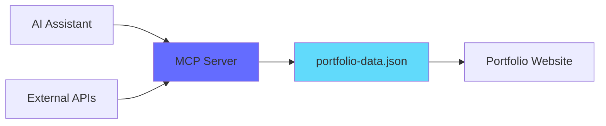

# Portfolio MCP Server

Model Context Protocol (MCP) Server for dynamic portfolio content management.

## 🎯 Features

- ✅ **Dynamic Portfolio Management** - Manage projects, skills, and experiences via AI chat
- ✅ **Dual Mode Operation** - Local (stdio) và Remote (HTTP API)
- ✅ **Claude Desktop Integration** - Native MCP protocol support
- ✅ **Mobile Support** - Deploy to cloud for Claude mobile app
- ✅ **Type-Safe** - Zod schema validation
- ✅ **RESTful API** - HTTP endpoints for web/mobile access

---

## 📦 Installation

```bash
# Install dependencies
npm install

# Build TypeScript
npm run build

# Test local MCP server
npm run start

# Test HTTP API server
npm run start:api
```

---

## 🚀 Usage

### **Option 1: Local MCP (Claude Desktop Only)**

**Use case:** Fast local development, desktop-only usage

**Setup:**
1. Build server: `npm run build`
2. Configure Claude Desktop:
   ```json
   // %APPDATA%\Claude\claude_desktop_config.json
   {
     "mcpServers": {
       "portfolio": {
         "command": "node",
         "args": ["d:\\portfolio_thienphuc\\mcp-server\\dist\\index.js"]
       }
     }
   }
   ```
3. Restart Claude Desktop
4. Test: "Show me all my portfolio projects"

**Pros:**
- ⚡ Fast (no network latency)
- 🔒 Secure (data stays local)
- 🆓 Free

**Cons:**
- ❌ Desktop only
- ❌ No mobile access

---

### **Option 2: Remote MCP (Mobile + Web + Desktop)**

**Use case:** Access from anywhere, mobile app support

**Setup:**

1. **Deploy to cloud:**
   ```bash
   # Option A: Vercel (recommended)
   npm install -g vercel
   vercel --prod
   
   # Option B: Railway
   # Push to GitHub, deploy via Railway UI
   
   # Option C: Render
   # Connect GitHub, auto-deploy
   ```

2. **Configure on Claude.ai website:**
   ```
   Settings → Connectors → Add Custom Connector
   Name: Portfolio MCP
   URL: https://your-app.vercel.app
   ```

3. **Auto-sync to mobile:**
   - Settings sync automatically
   - Open Claude mobile app
   - Test: "Show me all projects"

**Pros:**
- ✅ Works on mobile, web, desktop
- ✅ Access from anywhere
- ✅ Multi-device sync

**Cons:**
- 🌐 Requires internet
- 💰 May have costs (usually free tier available)

**See:** `../MCP_MOBILE_SETUP.md` for detailed guide

---

## 📚 API Endpoints

Base URL (local): `http://localhost:3001`  
Base URL (remote): `https://your-deployed-url.com`

### **MCP Metadata**
```http
GET /mcp/info
GET /health
```

### **Projects**
```http
GET    /api/projects       # Get all projects
GET    /api/projects/:id   # Get specific project
POST   /api/projects       # Add new project
PUT    /api/projects/:id   # Update project
DELETE /api/projects/:id   # Delete project
```

### **Skills**
```http
GET /api/skills            # Get all skills
```

### **Experiences**
```http
GET /api/experiences       # Get all work experiences
```

### **Export**
```http
GET /api/export            # Export entire portfolio
```

---

## 🔧 Development

### **Project Structure**
```
mcp-server/
├── src/
│   ├── index.ts           # MCP stdio server (for Claude Desktop)
│   ├── api.ts             # HTTP API server (for mobile/web)
│   ├── types.ts           # Zod schemas & TypeScript types
│   └── data/
│       └── portfolio-data.json  # Portfolio data
├── dist/                  # Compiled JavaScript
├── package.json
├── tsconfig.json
└── vercel.json           # Deployment config
```

### **Scripts**
```json
{
  "build": "tsc",                   // Compile TypeScript
  "dev": "tsx watch src/index.ts",  // Development with hot reload
  "start": "node dist/index.js",    // Start MCP server (stdio)
  "start:api": "node dist/api.js",  // Start HTTP API server
  "inspector": "..."                // MCP inspector for debugging
}
```

### **Testing**
```bash
# Test MCP server (stdio)
node dist/index.js

# Test HTTP API
npm run start:api
curl http://localhost:3001/health

# Test with MCP inspector
npm run inspector
```

---

## 📊 MCP Resources

| URI | Description |
|-----|-------------|
| `portfolio://projects` | All portfolio projects |
| `portfolio://skills` | Technical & professional skills |
| `portfolio://experiences` | Work experience history |
| `portfolio://metadata` | Version & last update info |

---

## 🛠️ MCP Tools

| Tool | Description |
|------|-------------|
| `add_project` | Add new project to portfolio |
| `update_project` | Update existing project |
| `delete_project` | Remove project from portfolio |
| `get_project` | Get specific project details |
| `add_skill` | Add new skill |
| `add_experience` | Add work experience |
| `export_portfolio` | Export all data as JSON |

---

## 🔒 Security

### **API Authentication** (Optional)

```typescript
// Set environment variable
MCP_API_KEY=your-secret-key

// API will check Bearer token
Authorization: Bearer your-secret-key
```

### **CORS Configuration**

```typescript
// Already configured in api.ts
origin: '*'  // For production, specify domains
```

### **Rate Limiting**

```bash
npm install express-rate-limit
# See MCP_MOBILE_SETUP.md for implementation
```

---

## 🌐 Deployment

### **Vercel** (Recommended)
```bash
vercel --prod
```

### **Railway**
```bash
# Push to GitHub
# Deploy via Railway UI
```

### **Render**
```bash
# Connect GitHub repo
# Auto-deploy on push
```

**See:** `../MCP_MOBILE_SETUP.md` for step-by-step deployment guide

---

## 📱 Mobile Setup

**Quick steps:**
1. Deploy MCP server to cloud (Vercel/Railway/Render)
2. Get public URL
3. Configure on Claude.ai website: Settings → Connectors
4. Settings auto-sync to mobile app
5. Test on Claude mobile app

**Detailed guide:** `../MCP_MOBILE_SETUP.md`

---

## 🐛 Troubleshooting

### **MCP server not connecting (Desktop)**
```bash
# Check file exists
dir dist\index.js

# Test manually
node dist\index.js
# Should see: "Portfolio MCP Server running on stdio"

# Check Claude config
type %APPDATA%\Claude\claude_desktop_config.json
```

### **API not responding (Remote)**
```bash
# Test health endpoint
curl https://your-app.vercel.app/health

# Check logs
vercel logs
# or
railway logs
```

### **Data not updating**
```bash
# Verify data file
type src\data\portfolio-data.json

# Check permissions
# Ensure write access to portfolio-data.json
```

---

## 📚 Documentation

| File | Description |
|------|-------------|
| `../MCP_QUICKSTART.md` | 5-minute quick start guide |
| `../MCP_INTEGRATION_GUIDE.md` | Complete integration guide |
| `../MCP_FIX_GUIDE.md` | Troubleshooting guide |
| `../MCP_MOBILE_SETUP.md` | Mobile deployment guide |
| `../MCP_SUMMARY.md` | Project summary |

---

## 🎯 Example Usage

### **Claude Desktop (Local MCP)**
```
User: Show me all my portfolio projects

Claude: I found 3 projects:
1. Banking Core System (2023)
   - Tech: Spring Boot, Kafka, PostgreSQL
   - Outcomes: -65% processing time

2. Predictive Analytics (2024)
   - Tech: Python, XGBoost, React
   - Outcomes: 92% forecast accuracy

3. Security Protocol X (2024)
   - Tech: OAuth 2.0, HashiCorp Vault
   - Outcomes: -95% security incidents
```

### **HTTP API (Remote)**
```bash
# Get all projects
curl https://your-app.vercel.app/api/projects

# Add new project
curl -X POST https://your-app.vercel.app/api/projects \
  -H "Content-Type: application/json" \
  -d '{
    "id": "04",
    "title": "E-COMMERCE PLATFORM",
    "category": "WEB",
    ...
  }'
```

---

## 📄 License

MIT License - See main project LICENSE

---

## 🤝 Contributing

Contributions welcome! Please:
1. Fork the repository
2. Create feature branch
3. Make changes
4. Submit pull request

---

## 📞 Support

- **Issues:** GitHub Issues
- **Documentation:** See `../MCP_*.md` files
- **Claude Community:** https://discord.gg/anthropic

---

**🎉 Enjoy AI-powered portfolio management!**


**Model Context Protocol (MCP) Server** for managing portfolio content dynamically — projects, skills, and work experiences.

## 🎯 Overview

This MCP server provides a structured interface to:
- **Manage Projects**: Add, update, delete, and retrieve portfolio projects
- **Manage Skills**: Track technical and professional skills
- **Manage Experiences**: Document work history and achievements
- **Export Data**: Generate JSON exports of all portfolio data

## 📦 Installation

```bash
cd mcp-server
npm install
```

## 🚀 Usage

### Development Mode

```bash
npm run dev
```

### Build for Production

```bash
npm run build
npm start
```

### Test with MCP Inspector

```bash
npm run inspector
```

## 🔧 Configuration

### Add to Claude Desktop

Add this configuration to your Claude Desktop config file:

**Windows**: `%APPDATA%\Claude\claude_desktop_config.json`
**macOS**: `~/Library/Application Support/Claude/claude_desktop_config.json`

```json
{
  "mcpServers": {
    "portfolio": {
      "command": "node",
      "args": ["d:\\portfolio_thienphuc\\mcp-server\\dist\\index.js"]
    }
  }
}
```

After building the project, restart Claude Desktop.

## 📚 Resources

The MCP server exposes the following resources:

### 1. `portfolio://projects`
Complete list of all portfolio projects with detailed information.

### 2. `portfolio://skills`
Complete list of technical and professional skills.

### 3. `portfolio://experiences`
Work experience history with achievements and technologies.

### 4. `portfolio://metadata`
Portfolio version and last update timestamp.

## 🛠️ Tools

### Project Management

#### `add_project`
Add a new project to the portfolio.

**Example:**
```json
{
  "id": "04",
  "title": "NEW PROJECT",
  "hoverTitle": "NEW",
  "cat": "WEB",
  "url": "https://example.com/image.jpg",
  "year": "2024",
  "brief": "Project description...",
  "strategy": "Strategy description...",
  "technical": "Technical details...",
  "methodology": ["Agile", "Scrum"],
  "ba_focus": ["Requirements", "Analysis"],
  "tech_stack": ["React", "TypeScript"],
  "outcomes": [
    {
      "label": "Performance",
      "value": "+50%",
      "desc": "Improved performance"
    }
  ]
}
```

#### `update_project`
Update an existing project.

**Example:**
```json
{
  "id": "01",
  "updates": {
    "title": "UPDATED TITLE",
    "year": "2024"
  }
}
```

#### `delete_project`
Delete a project from the portfolio.

**Example:**
```json
{
  "id": "04"
}
```

#### `get_project`
Retrieve details of a specific project.

**Example:**
```json
{
  "id": "01"
}
```

### Skill Management

#### `add_skill`
Add a new skill to the portfolio.

**Example:**
```json
{
  "id": "skill-006",
  "category": "Frontend",
  "name": "React",
  "level": "Expert",
  "yearsOfExperience": 5,
  "description": "Building modern web applications"
}
```

### Experience Management

#### `add_experience`
Add a new work experience.

**Example:**
```json
{
  "id": "exp-003",
  "company": "New Company Inc",
  "position": "Lead Business Analyst",
  "location": "Hanoi, Vietnam",
  "startDate": "2024-01",
  "current": true,
  "description": "Leading BA team...",
  "achievements": [
    "Achievement 1",
    "Achievement 2"
  ],
  "technologies": ["React", "Node.js"]
}
```

### Export

#### `export_portfolio`
Export entire portfolio data as JSON.

## 📁 Data Structure

Portfolio data is stored in `src/data/portfolio-data.json` with the following structure:

```typescript
{
  projects: Project[],
  skills: Skill[],
  experiences: Experience[],
  metadata: {
    lastUpdated: string,
    version: string
  }
}
```

## 🔐 Data Validation

All data is validated using [Zod](https://zod.dev/) schemas defined in `src/types.ts`. This ensures:
- Type safety
- Data integrity
- Automatic validation on read/write operations

## 🎨 Integration with Portfolio

### Using MCP Data in React Components

Once the MCP server is running, you can fetch data from it:

```typescript
// Example: Fetch projects from MCP server
const fetchProjects = async () => {
  // MCP client code here
  // This will be provided when you integrate with your app
};
```

### Syncing with External Sources

The MCP server can be extended to sync with:
- **GitHub API** - Auto-import repositories
- **LinkedIn API** - Sync work experience
- **Custom APIs** - Any external data source

## 🔄 Workflow



## 📝 Example Usage with AI

Once configured with Claude Desktop, you can use natural language commands:

- "Show me all my projects"
- "Add a new project about AI automation"
- "Update project 01 with new metrics"
- "Export my entire portfolio"
- "What skills do I have in the Business Analysis category?"

## 🐛 Troubleshooting

### Server won't start
- Ensure Node.js 18+ is installed
- Run `npm install` to install dependencies
- Check that `portfolio-data.json` exists and is valid JSON

### Data not updating
- Check file permissions on `portfolio-data.json`
- Verify the data passes Zod schema validation
- Check server logs for error messages

### Claude Desktop not connecting
- Verify the path in `claude_desktop_config.json` is absolute
- Ensure the server is built (`npm run build`)
- Restart Claude Desktop after configuration changes

## 🚀 Next Steps

### Planned Features
- [ ] GitHub API integration for auto-importing repos
- [ ] LinkedIn sync for experience data
- [ ] Analytics tracking
- [ ] Image optimization and hosting
- [ ] Backup and restore functionality
- [ ] Version control for portfolio data

## 📄 License

MIT License - See main portfolio LICENSE file

## 🤝 Contributing

This is part of the main portfolio project. See the main README for contribution guidelines.

---

**Built with ❤️ for dynamic portfolio management**
